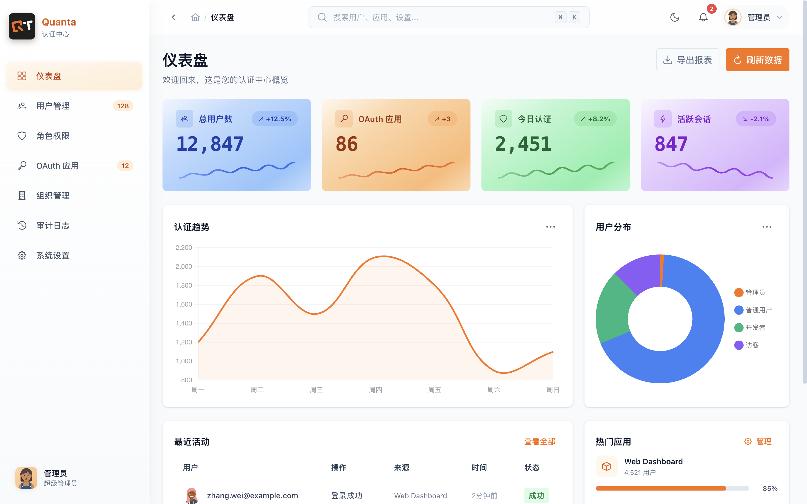
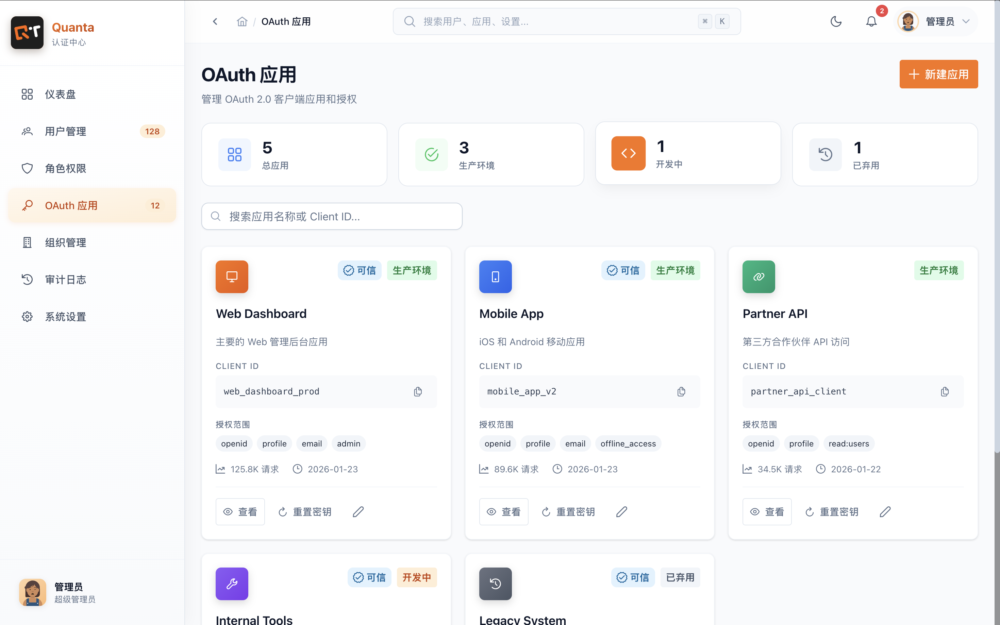
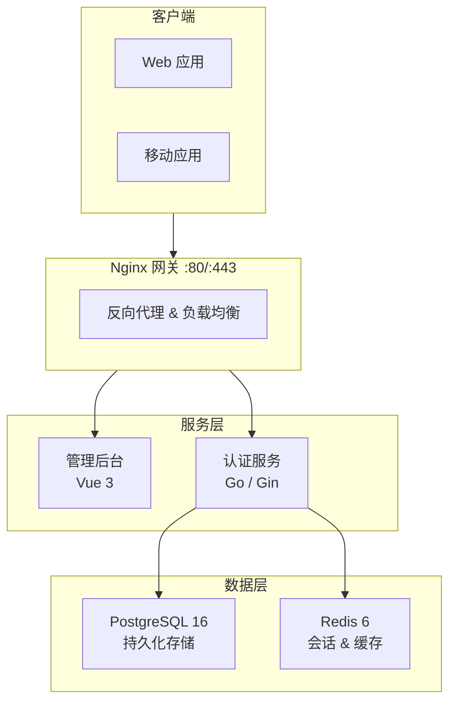

<p align="center">
  
</p>

<h1 align="center">Quanta Authentication</h1>

<p align="center">
  <strong>统一身份认证与授权服务系统</strong>
</p>

<p align="center">
  基于 OAuth 2.0 / OpenID Connect 标准 · Go + Vue 3 · Monorepo 架构
</p>

---

> **内部项目** - 本项目为实验室内部使用，仅限授权人员访问。

## 项目简介

**Quanta Authentication (QAuth)** 是一套面向组织的统一身份认证服务系统，完整实现了 OAuth 2.0 和 OpenID Connect 协议，提供用户身份管理、单点登录（SSO）以及基于角色的访问控制（RBAC）能力。

## 界面预览

<table align="center" style="border: none; border-collapse: collapse;">
  <tr>
    <td align="center" style="border: none; padding: 10px;">
      
      <br />
      <em>仪表盘 - 系统概览与数据统计</em>
    </td>
    <td align="center" style="border: none; padding: 10px;">
      
      <br />
      <em>OAuth 应用管理</em>
    </td>
  </tr>
</table>

## 核心服务能力

| 服务 | 描述 |
|:---|:---|
| **OAuth 2.0 授权** | 支持授权码模式、密码模式、客户端凭证模式 |
| **OpenID Connect** | 完整的 OIDC 身份认证协议实现 |
| **单点登录 (SSO)** | 一次登录，访问所有已授权应用 |
| **RBAC 权限控制** | 基于角色的细粒度访问控制 |
| **审计日志** | 完整的操作追踪与安全审计 |

## 系统架构



## 技术栈

| 服务 | 技术 |
|:---|:---|
| **认证服务** | Go 1.25 · Gin · GORM · PostgreSQL 16 · Redis |
| **管理后台** | Vue 3.5 · TypeScript · PrimeVue · TailwindCSS 4 |
| **构建工具** | Turborepo · pnpm · Rolldown Vite |
| **部署** | Docker Compose · Nginx |

## 项目结构

```
quanta-authentication/
├── packages/
│   ├── qauth-server/          # Go 认证服务
│   └── qauth-admin-web/       # Vue 管理后台
├── docker/                    # Docker 配置
└── nginx/                     # Nginx 网关配置
```

## 快速部署

### 环境要求

- Node.js >= 24
- Go >= 1.25
- pnpm >= 9.0
- Docker & Docker Compose

### Docker Compose（推荐）

```bash
pnpm docker:up

# 或直接使用 docker-compose 命令
docker-compose -f ./docker/docker-compose.yaml up -d
```

### 本地开发

```bash
# 安装依赖
pnpm install

# 启动所有服务
pnpm dev
```

### 服务地址

| 服务 | 地址 |
|:---|:---|
| 管理后台 | <http://localhost> |
| PostgreSQL | localhost:15432 |
| Redis | localhost:16379 |

## 子项目文档

| 子项目 | 说明 |
|:---|:---|
| [qauth-server](./packages/qauth-server/README.md) | Go 认证服务详细文档 |
| [qauth-admin-web](./packages/qauth-admin-web/README.md) | Vue 管理后台详细文档 |

---

<p align="center">
  <sub>Quanta Authentication · 实验室内部项目</sub>
</p>
