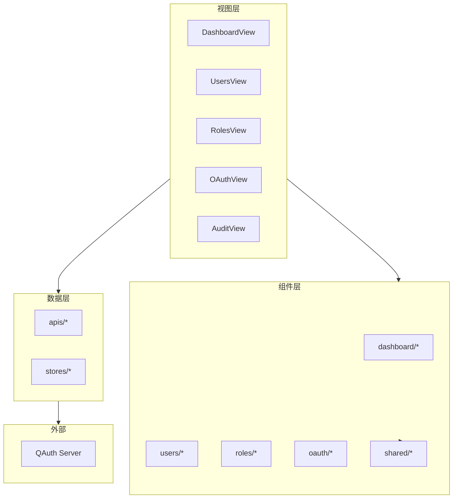

# QAuth Admin Web

基于 Vue 3 的认证系统管理后台。

## 技术栈

| 类别 | 技术 |
|:---|:---|
| 框架 | Vue 3.5 |
| 语言 | TypeScript |
| 构建工具 | Rolldown Vite |
| UI 组件 | PrimeVue 4.5 |
| 样式 | TailwindCSS 4 |
| 状态管理 | Pinia |
| 数据请求 | TanStack Vue Query + Axios |

## 项目结构

```
qauth-admin-web/
├── src/
│   ├── main.ts                # 应用入口
│   ├── App.vue                # 根组件
│   ├── style.css              # 全局样式
│   │
│   ├── apis/                  # API 接口层
│   │   ├── index.ts           # Axios 实例配置
│   │   ├── auth.ts            # 认证相关 API
│   │   ├── users.ts           # 用户管理 API
│   │   ├── roles.ts           # 角色管理 API
│   │   ├── oauth.ts           # OAuth 客户端 API
│   │   ├── app-group.ts       # 应用组管理 API
│   │   ├── dashboard.ts       # 仪表盘 API
│   │   ├── audit.ts           # 审计日志 API
│   │   └── ...
│   │
│   ├── components/            # 组件
│   │   ├── AppSidebar.vue     # 侧边栏
│   │   ├── AppTopbar.vue      # 顶部导航
│   │   ├── dashboard/         # 仪表盘组件
│   │   ├── users/             # 用户管理组件
│   │   ├── roles/             # 角色管理组件
│   │   ├── oauth/             # OAuth 组件
│   │   ├── permissions/       # 权限组件
│   │   └── shared/            # 共享组件
│   │
│   ├── composables/           # 组合式函数
│   │
│   ├── config/                # 应用配置
│   │
│   ├── layouts/               # 布局组件
│   │   ├── DefaultLayout.vue  # 主布局（侧边栏 + 内容）
│   │   └── AuthLayout.vue     # 认证页布局
│   │
│   ├── router/                # 路由配置
│   │   └── index.ts           # 路由定义与守卫
│   │
│   ├── stores/                # Pinia 状态管理
│   │
│   ├── types/                 # TypeScript 类型定义
│   │
│   └── views/                 # 页面视图
│       ├── DashboardView.vue  # 仪表盘
│       ├── UsersView.vue      # 用户管理
│       ├── RolesView.vue      # 角色管理
│       ├── PermissionsView.vue# 权限管理
│       ├── OAuthView.vue      # OAuth 应用
│       ├── AuditView.vue      # 审计日志
│       ├── SettingsView.vue   # 系统设置
│       └── ...
│
├── public/                    # 静态资源
├── nginx/                     # Nginx 配置
└── vite.config.ts             # Vite 配置
```

## 功能模块

### 仪表盘

系统概览与数据统计，展示：

- 用户总数、OAuth 应用数、今日认证次数
- 用户角色分布图表
- 认证趋势图表
- 最近活动记录

### 用户管理

完整的用户生命周期管理：

- 用户列表（分页、搜索、筛选）
- 创建 / 编辑 / 删除用户
- 用户角色分配
- 密码重置

### 角色权限

灵活的 RBAC 权限体系：

- 角色 CRUD
- 权限 CRUD
- 角色-权限关联管理
- 权限分组展示

### OAuth 应用

OAuth 2.0 客户端管理：

- 客户端创建与配置
- 重定向 URI 管理
- 授权范围（Scopes）配置
- 密钥重新生成
- 应用组权限与角色管理

### 审计日志

操作记录追踪：

- 日志列表查询（模块、操作、时间筛选）
- 日志详情查看
- 最近活动展示
- 日志导出

### 系统设置

系统配置管理界面。

## 组件架构



## 路由结构

| 路径 | 视图 | 说明 | 权限 |
|:---|:---|:---|:---|
| `/auth/login` | LoginView | 登录页 | 公开 |
| `/auth/register` | RegisterView | 注册页 | 公开 |
| `/` | DashboardView | 仪表盘 | 需认证 |
| `/users` | UsersView | 用户管理 | 需认证 |
| `/roles` | RolesView | 角色管理 | 需认证 |
| `/permissions` | PermissionsView | 权限管理 | 需认证 |
| `/oauth` | OAuthView | OAuth 应用 | 需认证 |
| `/organizations` | OrganizationsView | 组织架构 | 需认证 |
| `/audit` | AuditView | 审计日志 | 需认证 |
| `/settings` | SettingsView | 系统设置 | 需认证 |
| `/profile` | ProfileView | 个人资料 | 需认证 |

## 状态管理

使用 Pinia 进行状态管理，主要 Store：

| Store | 职责 |
|:---|:---|
| `useAuthStore` | 用户认证状态、令牌管理 |
| `useUserStore` | 当前用户信息 |
| 其他 | 按需使用 Vue Query 进行服务端状态管理 |

## 快速开始

### 安装依赖

```bash
pnpm install
```

### 开发模式

```bash
pnpm dev
```

### 构建生产版本

```bash
pnpm build
```

### 预览构建结果

```bash
pnpm preview
```

### 环境变量

| 变量 | 说明 |
|:---|:---|
| `VITE_API_BASE_URL` | API 基础路径（默认 `/api`） |
