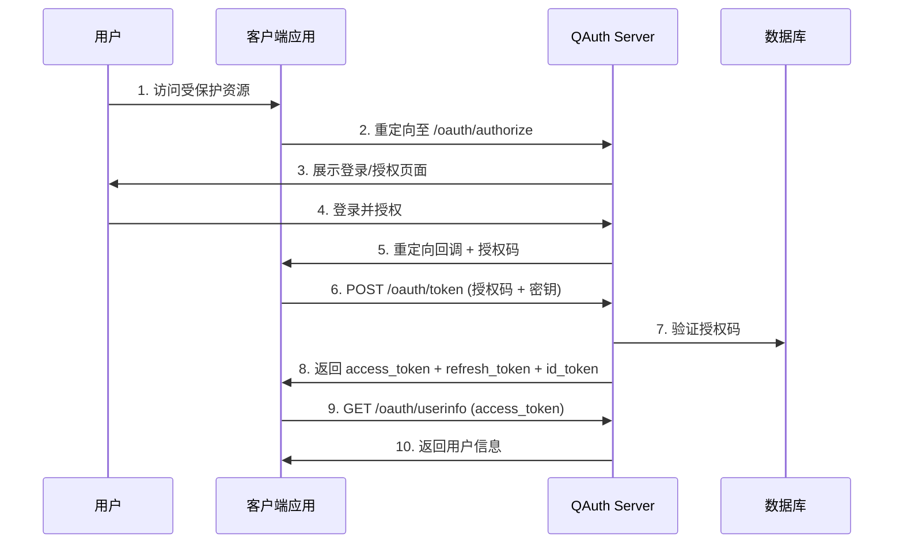
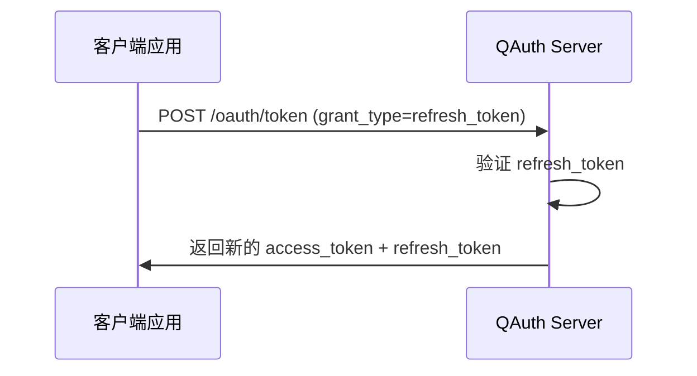

# QAuth Server

基于 Go 的 OAuth 2.0 / OpenID Connect 认证服务。

## 技术栈

| 类别 | 技术 |
|:---|:---|
| 语言 | Go 1.25 |
| Web 框架 | Gin |
| ORM | GORM |
| 数据库 | PostgreSQL 16 |
| 缓存 | Redis |
| 存储 | Go CDK（支持本地 / S3） |

## 项目结构

```
qauth-server/
├── main.go                    # 入口文件，服务初始化与启动
├── go.mod                     # Go 模块依赖
│
├── internal/                  # 内部包（不对外暴露）
│   ├── config/                # 配置管理
│   │   ├── config.go          # 环境变量解析与配置结构
│   │   ├── enums.go           # 枚举定义
│   │   └── permissions/       # 权限定义
│   │
│   ├── database/              # 数据库连接与迁移
│   │
│   ├── errors/                # 统一错误定义
│   │
│   ├── handlers/              # HTTP 请求处理器
│   │   ├── auth.go            # 用户认证（注册/登录/刷新令牌）
│   │   ├── oauth.go           # OAuth2 授权流程
│   │   ├── oidc.go            # OIDC 端点
│   │   ├── user.go            # 用户管理
│   │   ├── role.go            # 角色管理
│   │   ├── permission.go      # 权限管理
│   │   ├── app_group.go       # 应用组管理
│   │   ├── file.go            # 文件上传
│   │   └── business/          # 业务处理（仪表盘、审计）
│   │
│   ├── middleware/            # 中间件
│   │   ├── auth.go            # JWT 认证
│   │   ├── cors.go            # 跨域处理
│   │   └── logger.go          # 请求日志
│   │
│   ├── models/                # 数据模型（GORM）
│   │
│   ├── repository/            # 数据访问层
│   │
│   ├── routes/                # 路由注册
│   │
│   ├── services/              # 业务逻辑层
│   │   ├── oauth.go           # OAuth2 服务
│   │   ├── oidc.go            # OIDC 服务
│   │   ├── user.go            # 用户服务
│   │   ├── role.go            # 角色服务
│   │   ├── permission.go      # 权限服务
│   │   ├── audit.go           # 审计服务
│   │   └── app_group.go       # 应用组服务
│   │
│   ├── providers/             # 外部依赖抽象
│   │
│   ├── tasks/                 # 定时任务
│   │
│   └── utilities/             # 工具函数
│
└── pkg/                       # 可复用包
    ├── jwks/                  # JWKS 密钥管理
    ├── jwt/                   # JWT 工具
    └── response/              # 响应封装
```

## 核心模块

### Handlers（请求处理器）

| Handler | 职责 |
|:---|:---|
| `AuthHandler` | 用户注册、登录、令牌刷新 |
| `OAuthHandler` | OAuth2 授权码流程、令牌管理、客户端管理 |
| `OIDCHandler` | OpenID Connect 发现端点、JWKS |
| `UserHandler` | 用户 CRUD、角色分配 |
| `RoleHandler` | 角色 CRUD、权限分配 |
| `PermissionHandler` | 权限 CRUD |
| `AppGroupHandler` | 应用组管理（管理员、权限、角色） |
| `DashboardHandler` | 仪表盘统计数据 |
| `AuditHandler` | 审计日志查询 |

### Services（业务逻辑）

| Service | 职责 |
|:---|:---|
| `OAuthService` | OAuth2 授权处理、令牌生成与验证 |
| `OIDCService` | ID Token 生成、OIDC 配置 |
| `UserService` | 用户创建、认证、查询 |
| `RoleService` | 角色管理、用户角色关联 |
| `PermissionService` | 权限管理 |
| `AuditService` | 审计日志记录 |
| `AppGroupService` | 应用组权限与角色管理 |

## OAuth 2.0 认证流程

### 授权码模式



### 令牌刷新流程



## API 端点

### 公开端点

| 方法 | 路径 | 说明 |
|:---|:---|:---|
| GET | `/health` | 健康检查 |
| GET | `/.well-known/openid-configuration` | OIDC 发现文档 |
| GET | `/.well-known/jwks.json` | JWKS 公钥 |

### OAuth 端点（/v1/oauth）

| 方法 | 路径 | 说明 |
|:---|:---|:---|
| GET | `/authorize` | 授权页面 |
| POST | `/authorize` | 处理授权 |
| POST | `/token` | 获取令牌 |
| POST | `/validate` | 验证令牌 |
| POST | `/revoke` | 撤销令牌 |
| GET | `/userinfo` | 获取用户信息 |
| GET/POST | `/logout` | 登出 |

### 系统管理端点（/_/v1）

| 分组 | 端点 | 说明 |
|:---|:---|:---|
| `/auth` | register, login, refresh-token | 用户认证 |
| `/users` | CRUD + 角色管理 | 用户管理 |
| `/roles` | CRUD + 权限管理 | 角色管理 |
| `/permissions` | CRUD | 权限管理 |
| `/clients` | CRUD + 应用组管理 | OAuth 客户端管理 |
| `/dashboard` | stats, user-distribution, auth-trend | 仪表盘 |
| `/audit` | logs, activities, stats, export | 审计日志 |

## 环境变量

| 变量 | 默认值 | 说明 |
|:---|:---|:---|
| `PORT` | `8080` | 服务端口 |
| `GIN_MODE` | `debug` | 运行模式 |
| `DATABASE_URL` | - | PostgreSQL 连接字符串 |
| `REDIS_ADDR` | `localhost:6379` | Redis 地址 |
| `REDIS_PASSWORD` | - | Redis 密码 |
| `JWT_SECRET` | - | JWT 签名密钥 |
| `ACCESS_TOKEN_EXPIRE` | `3600` | Access Token 有效期（秒） |
| `REFRESH_TOKEN_EXPIRE` | `604800` | Refresh Token 有效期（秒） |
| `OIDC_ISSUER` | `http://localhost:8080` | OIDC 发行者 URL |
| `OIDC_KEY_ROTATION_INTERVAL` | `86400` | JWKS 密钥轮换间隔（秒） |
| `STORAGE_LOCAL_DIR` | `./uploads` | 本地存储目录 |

## 快速开始

### 安装依赖

```bash
pnpm install

# 或直接使用 go 命令
go mod download
```

### 配置环境

复制 `.env.example` 到 `.env` 并修改配置。

### 启动服务

```bash
pnpm dev

# 或直接使用 go 命令
go run main.go
```

服务将在 <http://localhost:8080> 启动。

### 构建

```bash
pnpm build

# 或直接使用 go 命令
go build -o ./dist/qauth-server main.go
```
