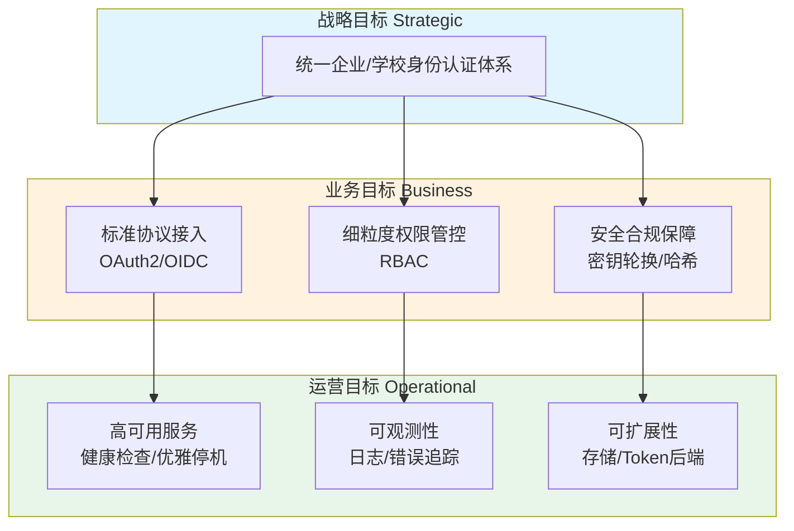
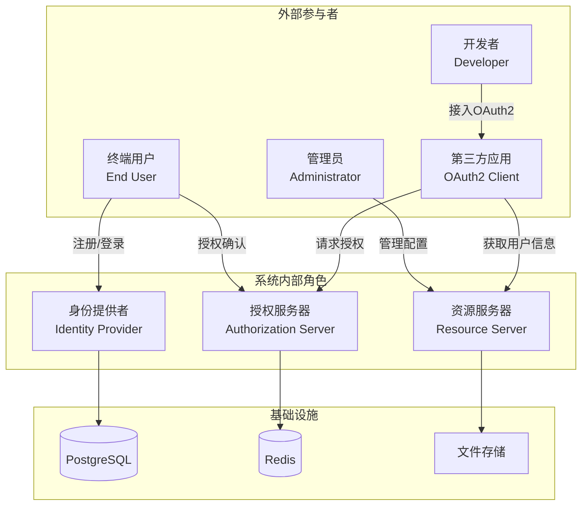
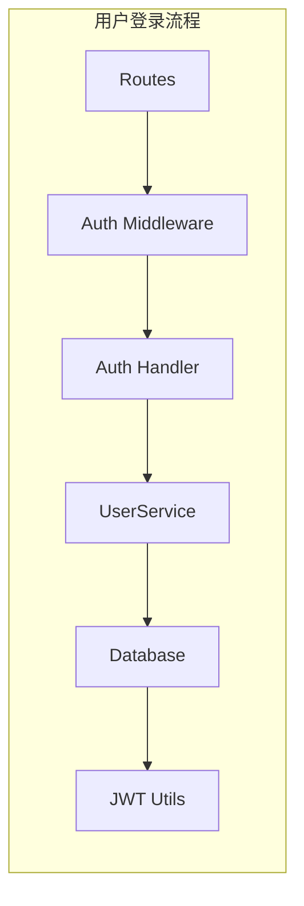
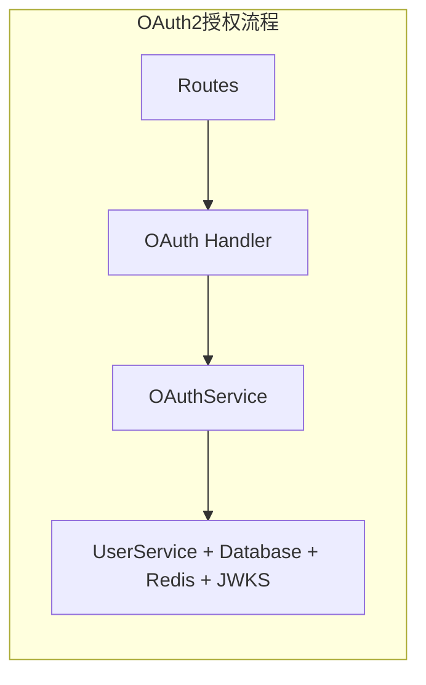
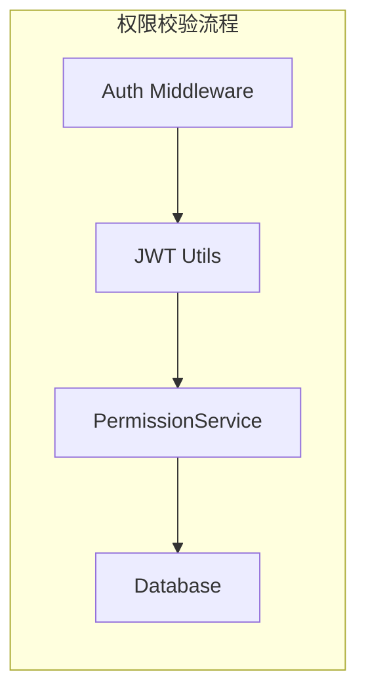
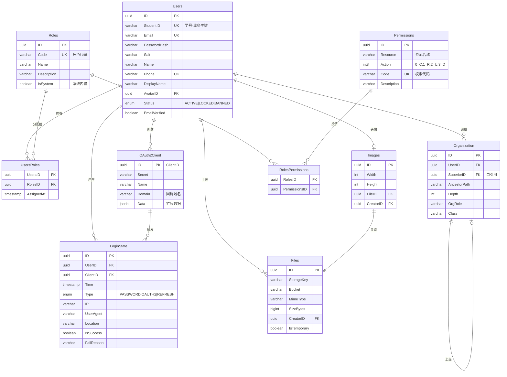
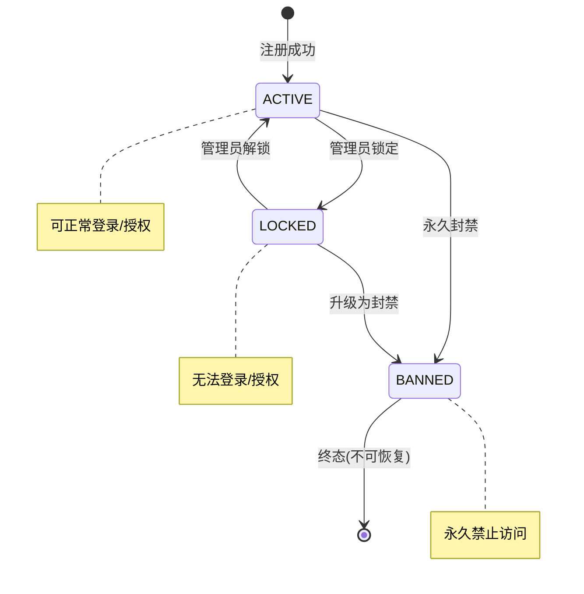
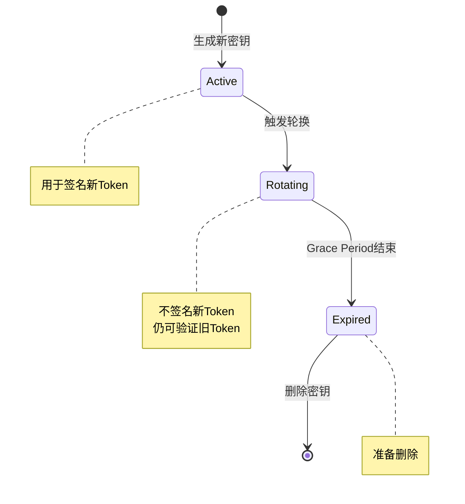
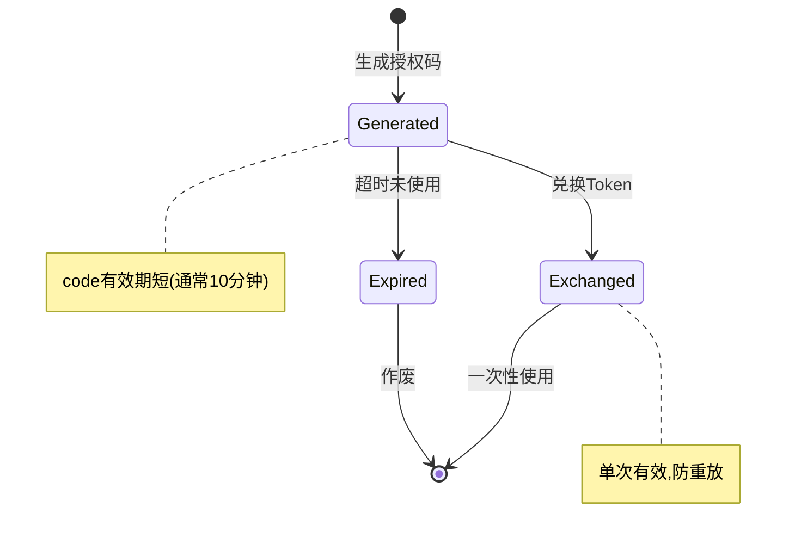
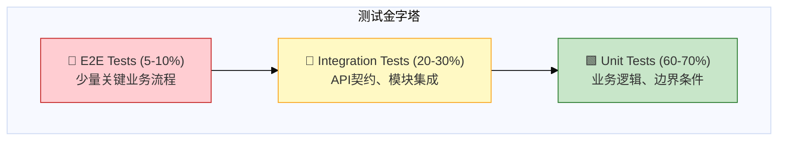

# QAuth Server 测试架构分析文档

> **文档版本**: 1.0  
> **分析基于**: PRD v1.0  
> **分析日期**: 2026-01-21  
> **角色**: QA Architect（测试架构师）

---

## 1. 核心业务目标与价值链

### 1.1 业务目标金字塔



### 1.2 价值链分析

| 价值阶段 | 核心活动 | 关键能力 | 测试关注点 |
|---------|---------|---------|-----------|
| **身份建立** | 用户注册 | 唯一性校验、密码安全存储 | 边界条件、冲突处理、安全性 |
| **身份验证** | 用户登录、OAuth授权 | 凭证验证、状态检查 | 正向流程、异常流程、状态机 |
| **令牌颁发** | JWT生成、Token管理 | 签名算法、过期机制 | 令牌完整性、时效性、安全性 |
| **权限控制** | RBAC校验 | 角色-权限映射 | 权限边界、越权测试 |
| **协议支持** | OIDC发现、JWKS | 标准协议合规 | 协议兼容性、互操作性 |
| **安全保障** | 密钥轮换、审计日志 | 生命周期管理 | 轮换正确性、日志完整性 |

### 1.3 关键业务指标 (KPIs)

| 指标类别 | 指标名称 | 测试验证方式 |
|---------|---------|-------------|
| **可用性** | 服务可用率 | 健康检查端点监控 |
| **性能** | 登录响应时间 | 负载测试 |
| **安全性** | 令牌有效性 | 过期/撤销测试 |
| **合规性** | OIDC标准符合度 | 协议一致性测试 |
| **可靠性** | 密钥轮换成功率 | 轮换流程测试 |

---

## 2. 关键参与角色 (Actors) 识别

### 2.1 角色全景图



### 2.2 角色详细定义

| Actor ID | 角色名称 | 角色描述 | 主要交互 | 测试场景关注点 |
|----------|---------|---------|---------|---------------|
| **ACT-01** | 终端用户 (End User) | 通过学号/工号进行身份认证的最终用户 | 注册、登录、授权确认、Token刷新 | 用户旅程完整性、状态转换 |
| **ACT-02** | 系统管理员 (Admin) | 具有 `system_admin` 或 `system_super_admin` 角色的管理用户 | 用户管理、角色管理、权限分配、客户端管理 | 权限边界、越权防护 |
| **ACT-03** | 开发者 (Developer) | 接入OAuth2/OIDC协议的第三方应用开发者 | 客户端注册、OIDC发现、JWKS获取 | 协议兼容性、错误处理 |
| **ACT-04** | OAuth2客户端 (Client) | 第三方应用系统 | 授权码获取、Token交换、用户信息获取 | 授权流程、令牌生命周期 |
| **ACT-05** | 身份提供者 (IdP) | QAuth Server 作为身份提供者 | 身份验证、ID Token签发 | OIDC协议合规性 |
| **ACT-06** | 定时任务 (Scheduler) | 系统内部定时任务（密钥轮换） | 密钥生成、密钥状态切换 | 轮换正确性、Grace Period |

### 2.3 角色权限矩阵

| 功能模块 | 终端用户 | 系统管理员 | 超级管理员 | OAuth2客户端 |
|---------|:-------:|:---------:|:---------:|:-----------:|
| 用户注册 | ✅ | ✅ | ✅ | ❌ |
| 用户登录 | ✅ | ✅ | ✅ | ❌ |
| Token刷新 | ✅ | ✅ | ✅ | ✅ |
| OAuth授权 | ✅ | ✅ | ✅ | ❌ |
| 客户端管理 | ❌ | ✅ | ✅ | ❌ |
| 角色管理 | ❌ | ⚠️ 部分 | ✅ | ❌ |
| 权限分配 | ❌ | ⚠️ 部分 | ✅ | ❌ |
| 密钥管理 | ❌ | ❌ | ✅ | ❌ |
| 用户信息获取 | ❌ | ❌ | ❌ | ✅ (授权后) |

---

## 3. 系统核心模块及依赖关系

### 3.1 模块架构图

```mermaid
graph TB
    subgraph 接入层 [接入层 - Entry Layer]
        GW[API Gateway / Routes]
        MW[中间件层<br/>Auth | CORS | Logger | Recovery]
    end
    
    subgraph 业务层 [业务层 - Business Layer]
        AUTH[认证模块<br/>Auth Handler]
        OAUTH[OAuth2模块<br/>OAuth Handler]
        OIDC_H[OIDC模块<br/>OIDC Handler]
        ROLE[角色模块<br/>Role Handler]
        PERM[权限模块<br/>Permission Handler]
        FILE[文件模块<br/>File Handler]
    end
    
    subgraph 服务层 [服务层 - Service Layer]
        USER_SVC[用户服务<br/>UserService]
        OAUTH_SVC[OAuth服务<br/>OAuthService]
        OIDC_SVC[OIDC服务<br/>OIDCService]
        ROLE_SVC[角色服务<br/>RoleService]
        PERM_SVC[权限服务<br/>PermissionService]
        FILE_SVC[文件服务<br/>FileService]
        STORAGE_SVC[存储服务<br/>StorageService]
    end
    
    subgraph 基础设施层 [基础设施层 - Infrastructure Layer]
        DB_MOD[数据库模块<br/>Database]
        JWT_MOD[JWT模块<br/>JWT Utils]
        JWKS_MOD[JWKS模块<br/>Key Manager]
        ENCRYPT[加密模块<br/>Encrypt Utils]
    end
    
    subgraph 外部依赖 [外部依赖 - External Dependencies]
        PG[(PostgreSQL)]
        REDIS[(Redis)]
        FS[文件系统/S3]
    end
    
    GW --> MW
    MW --> AUTH & OAUTH & OIDC_H & ROLE & PERM & FILE
    
    AUTH --> USER_SVC
    OAUTH --> OAUTH_SVC
    OIDC_H --> OIDC_SVC
    ROLE --> ROLE_SVC
    PERM --> PERM_SVC
    FILE --> FILE_SVC
    
    USER_SVC --> DB_MOD & ENCRYPT
    OAUTH_SVC --> DB_MOD & JWT_MOD & JWKS_MOD
    OIDC_SVC --> JWKS_MOD
    ROLE_SVC --> DB_MOD
    PERM_SVC --> DB_MOD
    FILE_SVC --> STORAGE_SVC
    
    DB_MOD --> PG
    OAUTH_SVC --> REDIS
    STORAGE_SVC --> FS
```

### 3.2 模块详细定义

| 模块ID | 模块名称 | 职责描述 | 入口端点 | 上游依赖 | 下游依赖 |
|--------|---------|---------|---------|---------|---------|
| **MOD-01** | 认证模块 (Auth) | 用户注册、登录、令牌刷新 | `/_/v1/auth/*` | Routes, Middleware | UserService, JWT |
| **MOD-02** | OAuth2模块 | OAuth2授权码流程、令牌管理 | `/v1/oauth/*` | Routes, Middleware | OAuthService, Redis |
| **MOD-03** | OIDC模块 | OIDC发现文档、JWKS端点 | `/.well-known/*` | Routes | OIDCService, JWKS |
| **MOD-04** | 角色模块 | 角色CRUD | `/_/v1/roles/*` | Auth Middleware | RoleService, DB |
| **MOD-05** | 权限模块 | 权限授予/撤销 | `/_/v1/permissions/*` | Auth Middleware | PermissionService, DB |
| **MOD-06** | 客户端模块 | OAuth2客户端管理 | `/_/v1/clients/*` | Auth Middleware | OAuthService, DB |
| **MOD-07** | 文件模块 | 文件上传 | `/_/v1/resources/*` | Auth Middleware | FileService, Storage |
| **MOD-08** | 密钥模块 | JWKS密钥管理 | `/_/v1/jwks/*` | Auth Middleware | JWKS Manager |
| **MOD-09** | 健康检查 | 服务健康探测 | `/health` | Routes | - |

### 3.3 模块依赖矩阵

| 模块 | Auth | OAuth2 | OIDC | Role | Permission | Client | File | JWKS |
|------|:----:|:------:|:----:|:----:|:----------:|:------:|:----:|:----:|
| **Auth** | - | ❌ | ❌ | ❌ | ❌ | ❌ | ❌ | ❌ |
| **OAuth2** | ✅ | - | ✅ | ✅ | ✅ | ❌ | ❌ | ✅ |
| **OIDC** | ❌ | ❌ | - | ❌ | ❌ | ❌ | ❌ | ✅ |
| **Role** | ✅ | ❌ | ❌ | - | ✅ | ❌ | ❌ | ❌ |
| **Permission** | ✅ | ❌ | ❌ | ✅ | - | ❌ | ❌ | ❌ |
| **Client** | ✅ | ❌ | ❌ | ❌ | ✅ | - | ❌ | ❌ |
| **File** | ✅ | ❌ | ❌ | ❌ | ❌ | ❌ | - | ❌ |
| **JWKS** | ✅ | ❌ | ❌ | ❌ | ❌ | ❌ | ❌ | - |

> **图例**: ✅ = 依赖 | ❌ = 无依赖

### 3.4 关键依赖路径 (Critical Path)







---

## 4. 业务实体关系图

### 4.1 核心实体关系 (ER Diagram)



### 4.2 实体分类与测试重点

| 实体类别 | 实体名称 | 核心约束 | 测试重点 |
|---------|---------|---------|---------|
| **核心实体** | Users | StudentID/Email/Phone唯一 | 唯一性冲突、状态机转换 |
| **核心实体** | Roles | Code唯一、IsSystem不可删除 | 系统角色保护 |
| **核心实体** | Permissions | Code唯一 | 权限码完整性 |
| **关联实体** | UsersRoles | 复合主键 | 多角色分配 |
| **关联实体** | RolesPermissions | 复合主键 | 权限继承 |
| **业务实体** | OAuth2Client | Secret安全性 | 客户端认证 |
| **审计实体** | LoginState | 历史记录不可篡改 | 审计完整性 |
| **层级实体** | Organization | 自引用树结构 | 层级遍历、路径正确性 |
| **资源实体** | Files / Images | 外键完整性 | 文件关联、孤儿清理 |

### 4.3 状态机模型

#### 4.3.1 用户状态机 (User Status)



#### 4.3.2 密钥状态机 (JWKS Key Status)



#### 4.3.3 OAuth2授权码状态机



---

## 5. 测试架构建议

### 5.1 测试金字塔



### 5.2 关键测试场景识别

| 优先级 | 测试场景 | 测试类型 | 验证点 |
|:------:|---------|---------|-------|
| P0 | OAuth2授权码流程 | E2E | 完整授权流程、Token有效性 |
| P0 | 用户登录/Token刷新 | Integration | JWT签发、过期验证 |
| P0 | RBAC权限校验 | Integration | 角色-权限映射正确性 |
| P1 | 用户状态机转换 | Unit | 状态约束、非法转换拒绝 |
| P1 | 密钥轮换 | Integration | 新旧密钥共存期验证 |
| P1 | 唯一性约束 | Unit | 冲突检测、错误码 |
| P2 | OIDC协议合规性 | Contract | Discovery文档、Claims |
| P2 | 审计日志完整性 | Integration | LoginState记录 |

### 5.3 测试环境依赖

| 依赖项 | 测试环境方案 | 备注 |
|-------|-------------|------|
| PostgreSQL | Testcontainers / Docker | 数据隔离 |
| Redis | Testcontainers / Docker | Token存储 |
| 文件系统 | 内存文件系统 / 临时目录 | 隔离清理 |

---

## 6. 风险与待澄清项

### 6.1 架构风险点

| 风险ID | 风险描述 | 影响评估 | 测试缓解措施 |
|--------|---------|---------|-------------|
| R-01 | 密钥轮换期间新旧密钥验证逻辑 | 高 | Grace Period边界测试 |
| R-02 | 用户状态切换无暴露API | 中 | 数据库直接操作测试 |
| R-03 | Organization树结构性能 | 中 | 深层级遍历压测 |
| R-04 | Token存储Redis单点依赖 | 高 | 故障注入测试 |

### 6.2 待确认项 (从PRD继承)

| 项目 | 测试影响 | 建议 |
|------|---------|------|
| 头像上传功能 (TODO) | 无法测试picture claim | 待开发后补充 |
| 邮箱验证流程 (未实现) | EmailVerified字段测试受限 | Mock或跳过 |
| 密码重置功能 (未实现) | 安全性测试缺失 | 标记为已知Gap |
| 用户状态切换API (未暴露) | 状态机测试需绕行 | 直接DB操作 |

---

*文档版本: 1.0*  
*创建日期: 2026-01-21*  
*作者: QA Architect (AI-assisted)*
