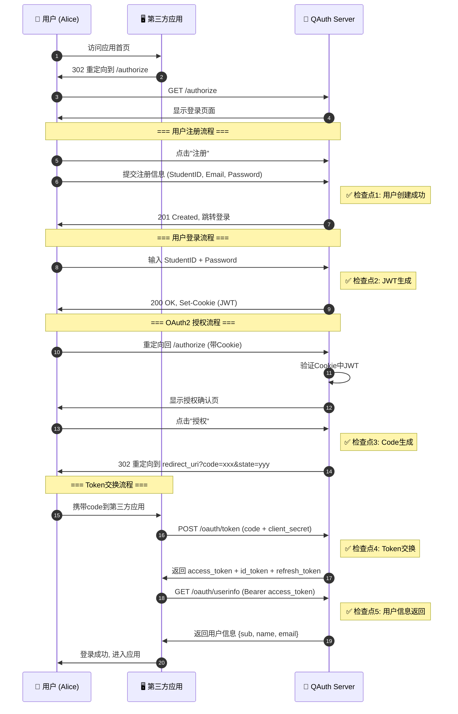
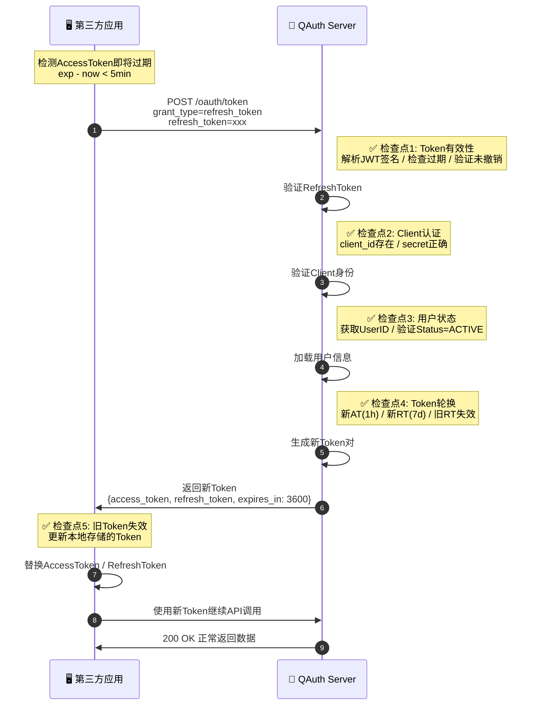
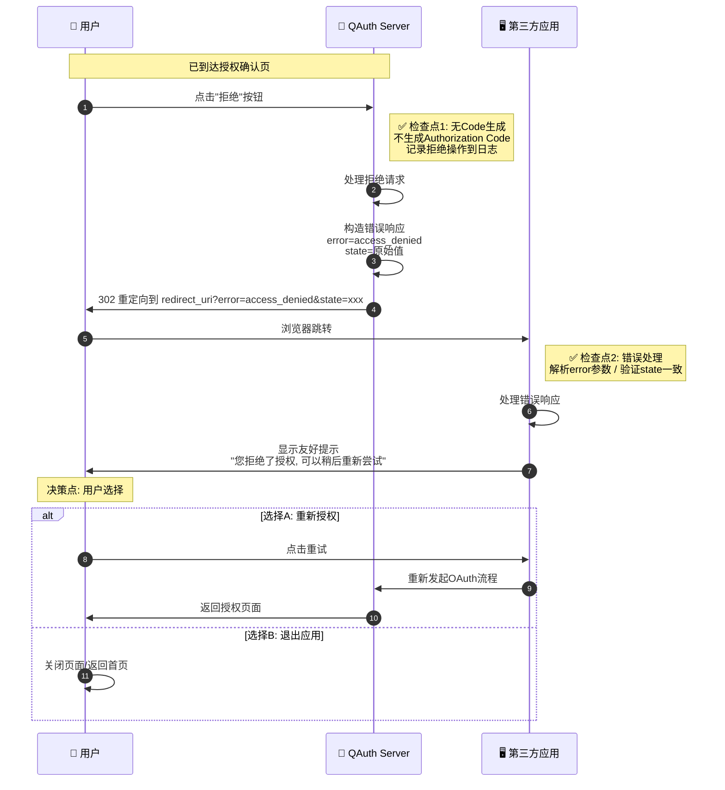
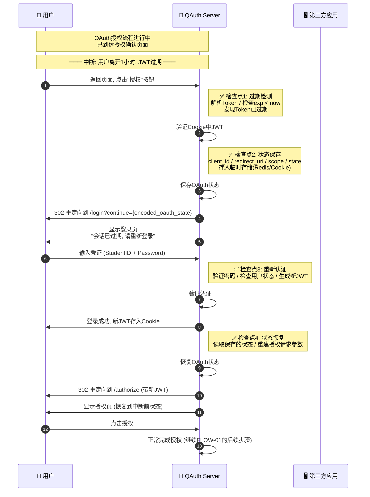
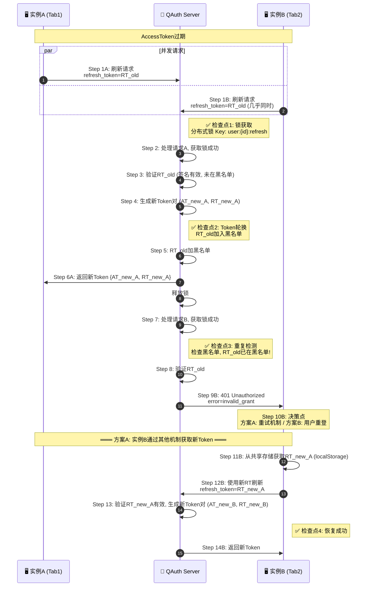
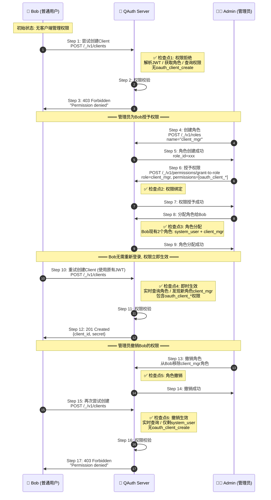
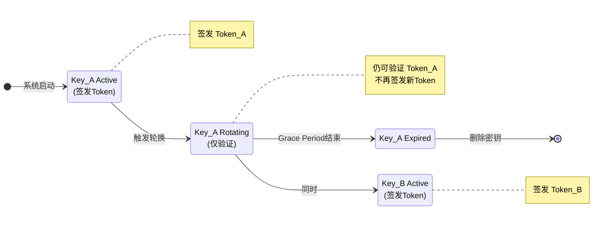
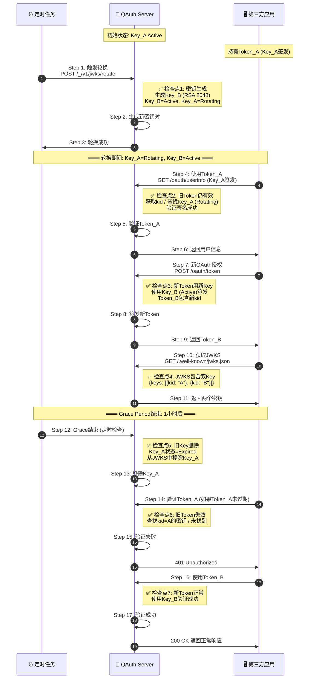

# QAuth Server 端到端业务场景流 (E2E Flows)

> **文档版本**: 1.0  
> **基于**: ARCHITECT.md v1.0, STRATEGY.md v1.0  
> **创建日期**: 2026-01-21  
> **角色**: QA Architect（测试架构师）

---

## 目录

1. [场景流概述](#1-场景流概述)
2. [Happy Path - 标准流](#2-happy-path---标准流)
   - [FLOW-01: 完整SSO单点登录流程](#flow-01-完整sso单点登录流程)
   - [FLOW-02: Token静默刷新续期流程](#flow-02-token静默刷新续期流程)
3. [Reverse Path - 逆向流](#3-reverse-path---逆向流)
   - [FLOW-03: OAuth授权拒绝与回退流程](#flow-03-oauth授权拒绝与回退流程)
   - [FLOW-04: Token撤销与重新认证流程](#flow-04-token撤销与重新认证流程)
4. [Interrupted Path - 中断流](#4-interrupted-path---中断流)
   - [FLOW-05: 授权过程Session过期恢复](#flow-05-授权过程session过期恢复)
   - [FLOW-06: 并发Token刷新竞态处理](#flow-06-并发token刷新竞态处理)
5. [Complex Logic Flow - 复杂逻辑流](#5-complex-logic-flow---复杂逻辑流)
   - [FLOW-07: 多角色权限动态变更流程](#flow-07-多角色权限动态变更流程)
   - [FLOW-08: JWKS密钥轮换期间Token验证](#flow-08-jwks密钥轮换期间token验证)
6. [场景流追踪矩阵](#6-场景流追踪矩阵)

---

## 1. 场景流概述

### 1.1 场景流分类

| 类型 | 标识 | 描述 | 测试目标 |
|------|:----:|------|---------|
| **Happy Path** | 🟢 | 用户最理想的操作闭环 | 验证核心业务流程完整性 |
| **Reverse Path** | 🟡 | 流程中途取消/失败/回退 | 验证逆向操作的正确处理 |
| **Interrupted Path** | 🟠 | 操作中断后的断点恢复 | 验证系统容错与状态恢复 |
| **Complex Logic Flow** | 🔴 | 多角色协同/状态机流转 | 验证复杂业务逻辑正确性 |

### 1.2 参与角色图例

| 角色 | 图例 | 描述 |
|------|:----:|------|
| 终端用户 | 👤 | 通过学号登录的最终用户 |
| 第三方应用 | 🖥️ | OAuth2 Client 应用 |
| QAuth Server | 🔐 | 身份认证服务器 |
| 系统管理员 | 👨‍💼 | 具有管理权限的用户 |
| 定时任务 | ⏰ | 系统内部调度器 |

### 1.3 状态标识

```
[开始] ──▶ 流程起点
[结束] ──▶ 流程终点
[决策] ──▶ 关键决策点（菱形）
[检查点] ──▶ 测试验证点
```

---

## 2. Happy Path - 标准流

### FLOW-01: 完整SSO单点登录流程

> **流程类型**: 🟢 Happy Path  
> **风险等级**: 🔴 高  
> **复杂度**: ⭐⭐⭐  
> **涉及模块**: Auth, OAuth2, OIDC, UserService

#### 场景描述

用户首次使用第三方应用，完成从注册、登录到OAuth2授权的完整单点登录闭环。

#### 参与者

- 👤 终端用户（Alice）
- 🖥️ 第三方应用（学生管理系统）
- 🔐 QAuth Server

#### 前置条件

- 第三方应用已在QAuth注册为OAuth2 Client
- 用户未注册/未登录

#### 流程图



#### 详细步骤

| Step | 执行者 | 操作 | 输入/条件 | 输出/结果 | 检查点 |
|:----:|:------:|------|----------|----------|--------|
| 1 | 👤 | 访问第三方应用首页 | URL: https://app.example.com | 应用检测未登录 | - |
| 2 | 🖥️ | 重定向到QAuth授权端点 | `response_type=code`, `client_id`, `redirect_uri`, `scope=openid profile email`, `state` | 302 重定向 | - |
| 3 | 🔐 | 显示登录页面 | 检测无有效Cookie | 登录表单页面 | - |
| 4 | 👤 | 点击"注册"链接 | - | 跳转注册页面 | - |
| 5 | 🔐 | 接收注册请求 | - | 准备接收表单 | - |
| 6 | 👤 | 提交注册信息 | `StudentID=20260001001`, `Email=alice@school.edu`, `Password=SecurePass123!`, `Name=Alice` | POST /_/v1/auth/register | ✅ **检查点1** |
| 7 | 🔐 | 返回注册成功 | 用户记录创建, Salt生成, 密码哈希存储 | 201 Created, 用户ID | 验证DB记录 |
| 8 | 👤 | 输入登录凭证 | StudentID + Password | 提交登录表单 | - |
| 9 | 🔐 | 处理登录请求 | 验证密码, 检查用户状态=ACTIVE | POST /_/v1/auth/login | ✅ **检查点2** |
| 10 | 🔐 | 返回登录成功 | 生成AccessToken(1h) + RefreshToken(7d) | 200 OK, Set-Cookie | 验证JWT结构 |
| 11 | 👤 | 重定向回authorize | Cookie中携带JWT | GET /v1/oauth/authorize | - |
| 12 | 🔐 | 验证用户身份 | 解析Cookie中JWT, 验证签名和有效期 | 用户已认证 | - |
| 13 | 🔐 | 显示授权确认页 | 展示请求的scope: profile, email | 授权确认界面 | - |
| 14 | 👤 | 点击"授权"按钮 | 确认授权 | POST /v1/oauth/authorize | - |
| 15 | 🔐 | 生成授权码 | 创建一次性code, 关联user/client/scope | Authorization Code | ✅ **检查点3** |
| 16 | 🔐 | 重定向到回调地址 | `redirect_uri?code=xxx&state=yyy` | 302 Redirect | 验证state一致 |
| 17 | 👤 | 浏览器跳转到应用 | 携带code参数 | 到达redirect_uri | - |
| 18 | 🖥️ | 发起Token交换请求 | `grant_type=authorization_code`, `code`, `client_id`, `client_secret` | POST /v1/oauth/token | ✅ **检查点4** |
| 19 | 🔐 | 验证并交换Token | 验证code有效/未过期/单次使用, 验证client认证 | 生成Tokens | 验证code作废 |
| 20 | 🔐 | 返回Token集 | access_token (RS256), id_token, refresh_token | 200 OK, JSON | 验证Token结构 |
| 21 | 🖥️ | 请求用户信息 | Authorization: Bearer {access_token} | GET /v1/oauth/userinfo | ✅ **检查点5** |
| 22 | 🔐 | 返回用户信息 | 根据scope返回claims | `{sub, name, email, student_id}` | 验证scope映射 |
| 23 | 🖥️ | 创建应用会话 | 存储用户信息, 建立应用session | 用户进入应用 | - |

#### 检查点验证

| 检查点 | 验证项 | 预期结果 |
|:------:|-------|---------|
| ✅ 1 | 用户创建 | DB中存在用户记录, PasswordHash≠明文, Salt非空 |
| ✅ 2 | JWT生成 | Token包含正确的UserID/StudentID/Role, exp正确 |
| ✅ 3 | Code生成 | Code有效期≤10分钟, 关联正确的user/client/scope |
| ✅ 4 | Token交换 | Code使用后立即失效, 无法重复使用 |
| ✅ 5 | 用户信息 | 返回字段与请求的scope一致 |

#### 后置条件

- ✅ 用户在QAuth中完成注册
- ✅ 用户获得有效的AccessToken和RefreshToken
- ✅ 第三方应用获得用户授权的信息
- ✅ LoginState表记录登录行为（Type=OAUTH2, IsSuccess=true）

---

### FLOW-02: Token静默刷新续期流程

> **流程类型**: 🟢 Happy Path  
> **风险等级**: 🔴 高  
> **复杂度**: ⭐⭐  
> **涉及模块**: Auth, OAuth2, JWT

#### 场景描述

用户的AccessToken即将过期，第三方应用使用RefreshToken静默获取新的Token对，保持用户会话不中断。

#### 参与者

- 🖥️ 第三方应用
- 🔐 QAuth Server

#### 前置条件

- 用户已完成OAuth2授权流程
- 第三方应用持有有效的RefreshToken
- AccessToken即将或已经过期

#### 流程图



#### 详细步骤

| Step | 执行者 | 操作 | 输入/条件 | 输出/结果 | 检查点 |
|:----:|:------:|------|----------|----------|--------|
| 1 | 🖥️ | 发起Token刷新请求 | `grant_type=refresh_token`, `refresh_token`, `client_id`, `client_secret` | POST /v1/oauth/token | - |
| 2 | 🔐 | 验证RefreshToken | 解析JWT, 验证签名, 检查exp, 查询Redis确认未撤销 | Token有效 | ✅ **检查点1** |
| 3 | 🔐 | 验证Client身份 | 匹配client_id和client_secret | Client认证通过 | ✅ **检查点2** |
| 4 | 🔐 | 加载并检查用户状态 | 从Token获取UserID, 查询DB | 用户Status=ACTIVE | ✅ **检查点3** |
| 5 | 🔐 | 生成新Token对 | 创建新的AT/RT, 将旧RT标记为已使用 | 新Token对 | ✅ **检查点4** |
| 6 | 🔐 | 返回新Token | JSON响应 | 200 OK | - |
| 7 | 🖥️ | 更新本地Token存储 | 替换旧Token | 存储完成 | ✅ **检查点5** |
| 8 | 🖥️ | 使用新Token调用API | Authorization: Bearer {new_access_token} | API请求 | - |
| 9 | 🔐 | 验证新Token并返回 | 验证签名/有效期 | 200 OK | - |

#### 检查点验证

| 检查点 | 验证项 | 预期结果 |
|:------:|-------|---------|
| ✅ 1 | Token有效性 | RefreshToken签名正确, 未过期, 未在黑名单 |
| ✅ 2 | Client认证 | client_id存在, secret匹配 |
| ✅ 3 | 用户状态 | 用户Status=ACTIVE, 非LOCKED/BANNED |
| ✅ 4 | Token轮换 | 新Token有效期正确, 旧RT标记失效 |
| ✅ 5 | 旧Token失效 | 使用旧RefreshToken刷新返回401 |

---

## 3. Reverse Path - 逆向流

### FLOW-03: OAuth授权拒绝与回退流程

> **流程类型**: 🟡 Reverse Path  
> **风险等级**: 🟡 中  
> **复杂度**: ⭐⭐  
> **涉及模块**: OAuth2

#### 场景描述

用户在OAuth授权确认页面选择"拒绝授权"，系统需要正确处理拒绝流程，并将用户安全地重定向回第三方应用。

#### 参与者

- 👤 终端用户
- 🖥️ 第三方应用
- 🔐 QAuth Server

#### 前置条件

- 用户已登录QAuth
- 已到达OAuth授权确认页面

#### 流程图



#### 详细步骤

| Step | 执行者 | 操作 | 输入/条件 | 输出/结果 | 检查点 |
|:----:|:------:|------|----------|----------|--------|
| 1 | 👤 | 点击"拒绝授权"按钮 | 授权确认页面 | 提交拒绝请求 | - |
| 2 | 🔐 | 处理拒绝请求 | 用户选择拒绝 | 不生成Code, 记录日志 | ✅ **检查点1** |
| 3 | 🔐 | 构造OAuth错误响应 | `error=access_denied`, `state=原始值` | 错误参数 | - |
| 4 | 🔐 | 重定向到回调地址 | `redirect_uri?error=access_denied&state=xxx` | 302 Redirect | - |
| 5 | 👤 | 浏览器自动跳转 | 携带错误参数 | 到达第三方应用 | - |
| 6 | 🖥️ | 解析错误响应 | 识别error参数, 验证state | 错误处理流程 | ✅ **检查点2** |
| 7 | 🖥️ | 显示友好提示 | - | 用户可选择重试或退出 | - |
| 8A | 👤 | (可选)重新授权 | 点击重试 | 重新发起OAuth流程 | - |
| 8B | 👤 | (可选)退出应用 | 关闭页面 | 流程结束 | - |

#### 检查点验证

| 检查点 | 验证项 | 预期结果 |
|:------:|-------|---------|
| ✅ 1 | 无Code生成 | 数据库/Redis中无新的Authorization Code |
| ✅ 2 | 错误处理 | 第三方应用正确解析error, state与发起时一致 |

#### 后置条件

- ✅ 用户的QAuth登录状态保持不变
- ✅ 无有效的授权记录产生
- ✅ 用户可以随时重新发起授权

---

### FLOW-04: Token撤销与重新认证流程

> **流程类型**: 🟡 Reverse Path  
> **风险等级**: 🔴 高  
> **复杂度**: ⭐⭐⭐  
> **涉及模块**: OAuth2, Auth

#### 场景描述

用户主动登出或管理员强制撤销用户Token，用户需要重新进行完整认证。

#### 参与者

- 👤 终端用户
- 🖥️ 第三方应用
- 🔐 QAuth Server

#### 前置条件

- 用户已完成OAuth2授权
- 第三方应用持有有效Token

#### 流程图

```mermaid
sequenceDiagram
    autonumber
    participant U as 👤 用户
    participant Q as 🔐 QAuth Server
    participant A as 🖥️ 第三方应用
    
    U->>Q: 点击"登出"
    
    Note right of Q: ✅ 检查点1: Token撤销
    Q->>Q: POST /oauth/revoke<br/>token=access_token
    Q->>Q: 加入Token黑名单<br/>AT + RT 加入Redis黑名单
    Q->>U: Set-Cookie: token=; expires=past
    Q->>U: 302 重定向到 post_logout_redirect_uri
    
    U->>A: 返回第三方应用
    A->>A: 清除会话<br/>删除本地Token / 清除session
    
    Note over U,A: ═══ 时间流逝: 第三方应用尝试使用已撤销Token ═══
    
    A->>Q: GET /oauth/userinfo (旧AT)
    
    Note right of Q: ✅ 检查点2: 撤销生效<br/>检查黑名单 / 发现Token已撤销
    Q->>Q: 验证Token
    Q->>A: 401 Unauthorized<br/>error="invalid_token"
    
    A->>Q: POST /oauth/token (旧RT)<br/>grant_type=refresh_token
    
    Note right of Q: ✅ 检查点3: RT撤销<br/>RT也在黑名单中
    Q->>A: 401 Unauthorized
    
    A->>U: 提示需要重新登录
    
    Note over U,Q: 重新发起OAuth流程 (回到FLOW-01)
```

#### 详细步骤

| Step | 执行者 | 操作 | 输入/条件 | 输出/结果 | 检查点 |
|:----:|:------:|------|----------|----------|--------|
| 1 | 👤 | 点击登出按钮 | 在QAuth或第三方应用 | 发起登出请求 | - |
| 2 | 🔐 | 接收撤销请求 | `token=access_token` | POST /v1/oauth/revoke | ✅ **检查点1** |
| 3 | 🔐 | 将Token加入黑名单 | AT和RT都加入Redis黑名单 | 黑名单更新 | - |
| 4 | 🔐 | 清除Cookie | Set-Cookie过期 | Cookie清除 | - |
| 5 | 🔐 | 重定向到登出回调 | post_logout_redirect_uri | 302 Redirect | - |
| 6 | 👤 | 返回第三方应用 | 登出完成页面 | 到达应用 | - |
| 7 | 🖥️ | 清除本地会话 | 删除存储的Token和session | 会话清除 | - |
| 8 | 🖥️ | 尝试使用旧Token | Authorization: Bearer {old_at} | API请求 | - |
| 9 | 🔐 | 验证Token | 检查黑名单 | Token在黑名单中 | ✅ **检查点2** |
| 10 | 🔐 | 返回401错误 | `error=invalid_token` | 401 Unauthorized | - |
| 11 | 🖥️ | 尝试刷新Token | `refresh_token=old_rt` | POST /v1/oauth/token | - |
| 12 | 🔐 | 拒绝刷新 | RT也在黑名单中 | 401 Unauthorized | ✅ **检查点3** |
| 13 | 🖥️ | 提示重新登录 | 显示登录入口 | 引导重新认证 | - |
| 14 | 👤 | 重新发起OAuth | 回到FLOW-01 | 新的认证流程 | - |

#### 检查点验证

| 检查点 | 验证项 | 预期结果 |
|:------:|-------|---------|
| ✅ 1 | Token撤销 | revoke接口返回200, Token加入黑名单 |
| ✅ 2 | AT撤销生效 | 使用已撤销AT返回401 |
| ✅ 3 | RT撤销生效 | 使用已撤销RT刷新返回401 |

---

## 4. Interrupted Path - 中断流

### FLOW-05: 授权过程Session过期恢复

> **流程类型**: 🟠 Interrupted Path  
> **风险等级**: 🟡 中  
> **复杂度**: ⭐⭐⭐  
> **涉及模块**: OAuth2, Auth, Middleware

#### 场景描述

用户在OAuth授权过程中，由于长时间未操作导致Session（JWT）过期，需要重新登录后恢复到授权流程。

#### 参与者

- 👤 终端用户
- 🖥️ 第三方应用
- 🔐 QAuth Server

#### 前置条件

- 用户已登录QAuth
- 正在进行OAuth授权流程
- JWT即将或已经过期

#### 流程图



#### 详细步骤

| Step | 执行者 | 操作 | 输入/条件 | 输出/结果 | 检查点 |
|:----:|:------:|------|----------|----------|--------|
| 1 | 👤 | 返回页面点击授权 | 页面可能已缓存 | POST /v1/oauth/authorize | - |
| 2 | 🔐 | 验证Cookie中的JWT | 解析Token, 检查exp | Token已过期 | ✅ **检查点1** |
| 3 | 🔐 | 保存当前OAuth状态 | client_id, redirect_uri, scope, state | 存入Redis/加密Cookie | ✅ **检查点2** |
| 4 | 🔐 | 重定向到登录页 | `continue=encoded_state` | 302 Redirect | - |
| 5 | 🔐 | 显示登录页 | 提示会话过期 | 登录表单 | - |
| 6 | 👤 | 输入登录凭证 | StudentID + Password | 提交登录 | - |
| 7 | 🔐 | 验证并生成新JWT | 验证凭证, 检查状态 | 新的JWT | ✅ **检查点3** |
| 8 | 🔐 | 设置新Cookie | JWT存入Cookie | Set-Cookie | - |
| 9 | 🔐 | 恢复OAuth状态 | 从存储中读取 | 重建授权参数 | ✅ **检查点4** |
| 10 | 🔐 | 重定向到authorize | 携带新JWT和原OAuth参数 | 302 Redirect | - |
| 11 | 🔐 | 显示授权确认页 | 与中断前一致 | 授权页面 | - |
| 12 | 👤 | 点击授权 | 确认授权 | 提交授权 | - |
| 13 | 🔐 | 完成授权流程 | 生成Code, 重定向 | 继续FLOW-01 | - |

#### 检查点验证

| 检查点 | 验证项 | 预期结果 |
|:------:|-------|---------|
| ✅ 1 | 过期检测 | 正确识别JWT已过期 |
| ✅ 2 | 状态保存 | OAuth参数完整保存, 包含原始state |
| ✅ 3 | 重新认证 | 新JWT有效, 用户身份正确 |
| ✅ 4 | 状态恢复 | 恢复的OAuth参数与原始一致 |

---

### FLOW-06: 并发Token刷新竞态处理

> **流程类型**: 🟠 Interrupted Path  
> **风险等级**: 🔴 高  
> **复杂度**: ⭐⭐⭐  
> **涉及模块**: OAuth2, Auth

#### 场景描述

用户在多个标签页或多个设备上同时使用应用，当AccessToken过期时，多个客户端实例同时发起Token刷新请求，系统需要正确处理这种竞态条件。

#### 参与者

- 🖥️ 第三方应用 (实例A - 浏览器Tab1)
- 🖥️ 第三方应用 (实例B - 浏览器Tab2)
- 🔐 QAuth Server

#### 前置条件

- 同一用户在多个标签页打开应用
- 所有实例共享同一RefreshToken
- AccessToken刚刚过期

#### 流程图



#### 详细步骤

| Step | 执行者 | 操作 | 输入/条件 | 输出/结果 | 检查点 |
|:----:|:------:|------|----------|----------|--------|
| 1A | 🖥️ A | 发起刷新请求 | refresh_token=RT_old | POST /v1/oauth/token | - |
| 1B | 🖥️ B | 几乎同时发起刷新 | refresh_token=RT_old | POST /v1/oauth/token | - |
| 2 | 🔐 | 处理请求A, 获取锁 | 分布式锁Key: user:{id}:refresh | 锁获取成功 | ✅ **检查点1** |
| 3 | 🔐 | 验证RT_old | 签名, 黑名单检查 | 验证通过 | - |
| 4 | 🔐 | 生成新Token对 | 为用户生成新AT/RT | AT_new_A, RT_new_A | - |
| 5 | 🔐 | RT_old加入黑名单 | 防止重复使用 | 黑名单更新 | ✅ **检查点2** |
| 6A | 🔐 | 返回新Token给A | JSON响应 | 200 OK | - |
| 7 | 🔐 | 处理请求B, 获取锁 | 等待A释放锁后获取 | 锁获取成功 | - |
| 8 | 🔐 | 验证RT_old | 检查黑名单 | RT_old在黑名单 | ✅ **检查点3** |
| 9B | 🔐 | 返回错误给B | error=invalid_grant | 401 Unauthorized | - |
| 10B | 🖥️ B | 处理错误, 决策 | 选择恢复策略 | - | - |
| 11B | 🖥️ B | 从共享存储获取新RT | localStorage/sessionStorage | RT_new_A | - |
| 12B | 🖥️ B | 使用新RT刷新 | refresh_token=RT_new_A | POST /v1/oauth/token | - |
| 13 | 🔐 | 验证并生成Token | 正常处理 | AT_new_B, RT_new_B | - |
| 14B | 🔐 | 返回新Token给B | JSON响应 | 200 OK | ✅ **检查点4** |

#### 检查点验证

| 检查点 | 验证项 | 预期结果 |
|:------:|-------|---------|
| ✅ 1 | 锁获取 | 分布式锁防止并发处理同一RT |
| ✅ 2 | Token轮换 | RT_old在第一次成功后立即失效 |
| ✅ 3 | 重复检测 | 第二次使用RT_old被正确拒绝 |
| ✅ 4 | 恢复成功 | 实例B通过共享机制获取新Token |

#### 关键设计点

1. **分布式锁**: 使用Redis分布式锁避免并发处理同一RefreshToken
2. **Token立即失效**: RT使用后立即加入黑名单
3. **客户端恢复机制**: 建议客户端实现Token共享存储

---

## 5. Complex Logic Flow - 复杂逻辑流

### FLOW-07: 多角色权限动态变更流程

> **流程类型**: 🔴 Complex Logic Flow  
> **风险等级**: 🔴 高  
> **复杂度**: ⭐⭐⭐  
> **涉及模块**: Role, Permission, Auth, Middleware

#### 场景描述

管理员为用户动态添加/移除角色和权限，验证权限变更能够即时生效，用户无需重新登录即可获得/失去相应权限。

#### 参与者

- 👤 普通用户（Bob）
- 👨‍💼 系统管理员（Admin）
- 🔐 QAuth Server

#### 前置条件

- Bob 已注册并登录，角色为 `system_user`
- Admin 已登录，角色为 `system_super_admin`
- Bob 当前无 `oauth_client_create` 权限

#### 流程图



#### 详细步骤

| Step | 执行者 | 操作 | 输入/条件 | 输出/结果 | 检查点 |
|:----:|:------:|------|----------|----------|--------|
| 1 | 👤 | 尝试创建OAuth Client | Bob的JWT | POST /_/v1/clients | - |
| 2 | 🔐 | 权限校验 | 查询Bob的角色和权限 | 无oauth_client_create | ✅ **检查点1** |
| 3 | 🔐 | 返回拒绝 | error=permission_denied | 403 Forbidden | - |
| 4 | 👨‍💼 | 创建新角色 | name=client_mgr | POST /_/v1/roles | - |
| 5 | 🔐 | 返回角色ID | role_id | 201 Created | - |
| 6 | 👨‍💼 | 授予权限给角色 | role=client_mgr, permissions=[oauth_client_*] | POST /_/v1/permissions/grant-to-role | - |
| 7 | 🔐 | 权限绑定成功 | DB更新 | 200 OK | ✅ **检查点2** |
| 8 | 👨‍💼 | 分配角色给Bob | user=Bob, role=client_mgr | 角色分配 | - |
| 9 | 🔐 | 角色分配成功 | Bob现有2个角色 | 200 OK | ✅ **检查点3** |
| 10 | 👤 | 重试创建Client | 使用原JWT (无需重新登录) | POST /_/v1/clients | - |
| 11 | 🔐 | 权限校验 | 实时查询角色权限 | 发现新权限 | ✅ **检查点4** |
| 12 | 🔐 | 创建成功 | 生成client_id, secret | 201 Created | - |
| 13 | 👨‍💼 | 撤销Bob的角色 | 移除client_mgr | 角色撤销 | - |
| 14 | 🔐 | 撤销成功 | DB更新 | 200 OK | ✅ **检查点5** |
| 15 | 👤 | 再次尝试创建 | 仍用原JWT | POST /_/v1/clients | - |
| 16 | 🔐 | 权限校验 | 实时查询 | 权限已失 | ✅ **检查点6** |
| 17 | 🔐 | 返回拒绝 | error=permission_denied | 403 Forbidden | - |

#### 检查点验证

| 检查点 | 验证项 | 预期结果 |
|:------:|-------|---------|
| ✅ 1 | 初始权限拒绝 | 无权限用户被正确拒绝 |
| ✅ 2 | 权限绑定 | 角色-权限关系正确建立 |
| ✅ 3 | 角色分配 | 用户-角色关系正确建立 |
| ✅ 4 | 即时生效 | 无需重新登录, 新权限立即可用 |
| ✅ 5 | 角色撤销 | 用户-角色关系正确移除 |
| ✅ 6 | 撤销生效 | 权限立即失效, 被正确拒绝 |

#### 关键设计点

1. **实时权限查询**: 每次API请求都从DB实时查询用户当前角色和权限
2. **JWT不存储权限**: JWT仅存储UserID, 权限信息实时获取
3. **无缓存或短缓存**: 权限数据不缓存或极短缓存, 确保即时生效

---

### FLOW-08: JWKS密钥轮换期间Token验证

> **流程类型**: 🔴 Complex Logic Flow  
> **风险等级**: 🔴 高  
> **复杂度**: ⭐⭐⭐  
> **涉及模块**: JWKS, OIDC, OAuth2

#### 场景描述

系统自动或手动触发JWKS密钥轮换，在轮换过程中和Grace Period期间，验证新旧Token都能被正确验证，确保服务不中断。

#### 参与者

- ⏰ 定时任务/管理员
- 🖥️ 第三方应用
- 🔐 QAuth Server

#### 前置条件

- 系统正常运行，使用密钥Key_A签发Token
- 存在使用Key_A签发的有效Token (Token_A)
- 即将触发密钥轮换

#### 状态机



#### 流程图



#### 详细步骤

| Step | 执行者 | 操作 | 输入/条件 | 输出/结果 | 检查点 |
|:----:|:------:|------|----------|----------|--------|
| 1 | ⏰ | 触发密钥轮换 | POST /_/v1/jwks/rotate | 轮换请求 | - |
| 2 | 🔐 | 生成新密钥对 | RSA 2048位 | Key_B=Active, Key_A=Rotating | ✅ **检查点1** |
| 3 | 🔐 | 返回轮换成功 | 200 OK | 轮换完成 | - |
| 4 | 🖥️ | 使用旧Token访问 | Token_A (Key_A签发) | GET /oauth/userinfo | - |
| 5 | 🔐 | 验证旧Token | 查找Key_A, 验证签名 | 验证成功 | ✅ **检查点2** |
| 6 | 🔐 | 返回用户信息 | 正常响应 | 200 OK | - |
| 7 | 🖥️ | 发起新OAuth授权 | 完整授权流程 | POST /oauth/token | - |
| 8 | 🔐 | 签发新Token | 使用Key_B签发 | Token_B, kid=B | ✅ **检查点3** |
| 9 | 🔐 | 返回新Token | Token_B | 200 OK | - |
| 10 | 🖥️ | 获取JWKS | 更新本地公钥缓存 | GET /.well-known/jwks.json | - |
| 11 | 🔐 | 返回JWKS | 包含Key_A和Key_B | {keys: [A, B]} | ✅ **检查点4** |
| 12 | ⏰ | Grace Period结束 | 1小时后 | 定时检查 | - |
| 13 | 🔐 | 移除旧密钥 | Key_A状态=Expired, 从JWKS移除 | Key_A删除 | ✅ **检查点5** |
| 14 | 🖥️ | 尝试使用旧Token | Token_A (如未过期) | API请求 | - |
| 15 | 🔐 | 验证失败 | 找不到kid=A的密钥 | 401 Unauthorized | ✅ **检查点6** |
| 16 | 🖥️ | 使用新Token | Token_B | API请求 | - |
| 17 | 🔐 | 验证成功 | 使用Key_B验证 | 200 OK | ✅ **检查点7** |

#### 检查点验证

| 检查点 | 验证项 | 预期结果 |
|:------:|-------|---------|
| ✅ 1 | 密钥生成 | 新密钥RSA 2048位, 状态正确 |
| ✅ 2 | 旧Token仍有效 | Grace Period内旧Token可验证 |
| ✅ 3 | 新Token用新Key | 新签发Token使用新密钥 |
| ✅ 4 | JWKS包含双Key | 轮换期间JWKS返回两个密钥 |
| ✅ 5 | 旧Key删除 | Grace Period后Key_A从JWKS移除 |
| ✅ 6 | 旧Token失效 | Grace Period后旧Token验证失败 |
| ✅ 7 | 新Token正常 | 新Token始终可正常验证 |

#### 时间线

```mermaid
gantt
    title JWKS密钥轮换时间线
    dateFormat X
    axisFormat %s
    
    section Key_A
    Active (签发Token)     :active, a1, 0, 1
    Rotating (仅验证)      :crit, a2, 1, 2
    Expired (删除)         :done, a3, 2, 3
    
    section Key_B
    等待生成               :done, b0, 0, 1
    Active (签发Token)     :active, b1, 1, 3
    
    section 时间点
    T=0 触发轮换           :milestone, m1, 1, 0
    T=1h Grace Period结束  :milestone, m2, 2, 0
```



**时间点说明：**

| 时间 | Key_A 状态 | Key_B 状态 | 说明 |
|:----:|:----------:|:----------:|------|
| T=0 | Active | - | 触发轮换 |
| T=0+ | Rotating | Active | Grace Period开始 |
| T=1h | Expired | Active | Grace Period结束，删除Key_A |
| T=1h+ | (已删除) | Active | 仅Key_B可用 |

---

## 6. 场景流追踪矩阵

### 6.1 场景流与模块映射

| 场景流ID | 场景名称 | Auth | OAuth2 | OIDC | Role | Permission | JWKS |
|:--------:|---------|:----:|:------:|:----:|:----:|:----------:|:----:|
| FLOW-01 | 完整SSO流程 | ✅ | ✅ | ✅ | ✅ | - | ✅ |
| FLOW-02 | Token静默刷新 | ✅ | ✅ | - | - | - | - |
| FLOW-03 | OAuth授权拒绝 | - | ✅ | - | - | - | - |
| FLOW-04 | Token撤销重认证 | ✅ | ✅ | - | - | - | - |
| FLOW-05 | Session过期恢复 | ✅ | ✅ | - | - | - | - |
| FLOW-06 | 并发Token刷新 | ✅ | ✅ | - | - | - | - |
| FLOW-07 | 权限动态变更 | ✅ | - | - | ✅ | ✅ | - |
| FLOW-08 | 密钥轮换验证 | - | ✅ | ✅ | - | - | ✅ |

### 6.2 场景流与检查点总览

| 场景流ID | 类型 | 检查点数 | 风险等级 | 复杂度 | 预计执行时间 |
|:--------:|:----:|:--------:|:--------:|:------:|:-----------:|
| FLOW-01 | 🟢 Happy | 5 | 🔴 高 | ⭐⭐⭐ | 15-20 min |
| FLOW-02 | 🟢 Happy | 5 | 🔴 高 | ⭐⭐ | 5-10 min |
| FLOW-03 | 🟡 Reverse | 2 | 🟡 中 | ⭐⭐ | 5 min |
| FLOW-04 | 🟡 Reverse | 3 | 🔴 高 | ⭐⭐⭐ | 10-15 min |
| FLOW-05 | 🟠 Interrupted | 4 | 🟡 中 | ⭐⭐⭐ | 10-15 min |
| FLOW-06 | 🟠 Interrupted | 4 | 🔴 高 | ⭐⭐⭐ | 15-20 min |
| FLOW-07 | 🔴 Complex | 6 | 🔴 高 | ⭐⭐⭐ | 20-25 min |
| FLOW-08 | 🔴 Complex | 7 | 🔴 高 | ⭐⭐⭐ | 30+ min (含等待) |

### 6.3 执行优先级建议

| 优先级 | 场景流 | 理由 |
|:------:|--------|------|
| **P0** | FLOW-01 | 核心业务流程，必须保证 |
| **P0** | FLOW-02 | Token续期是高频操作 |
| **P0** | FLOW-08 | 密钥轮换影响全局安全 |
| **P1** | FLOW-04 | 安全相关的撤销机制 |
| **P1** | FLOW-07 | 权限控制核心逻辑 |
| **P1** | FLOW-06 | 并发场景常见问题 |
| **P2** | FLOW-05 | 用户体验相关 |
| **P2** | FLOW-03 | 边缘场景 |

---

*文档版本: 1.0*  
*创建日期: 2026-01-21*  
*作者: QA Architect (AI-assisted)*
