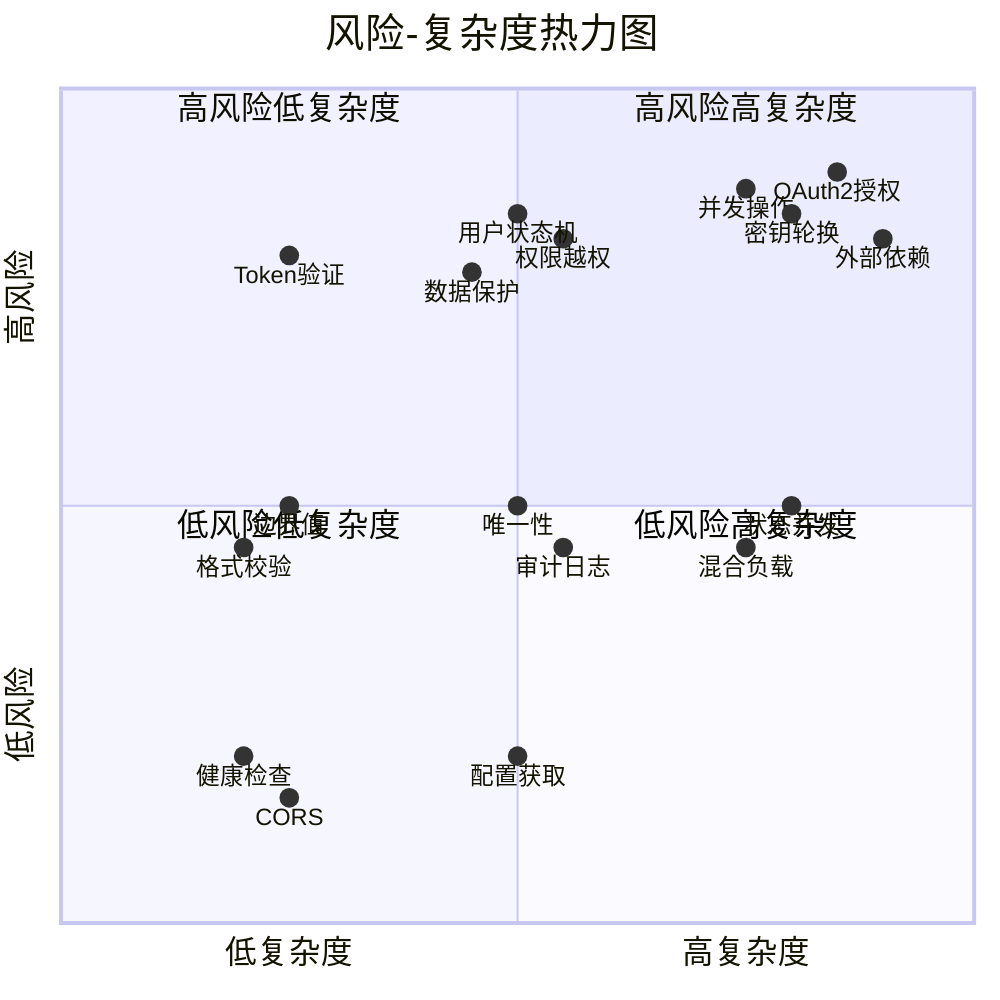
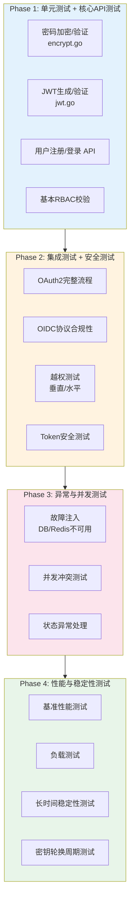

# QAuth Server 测试策略文档

> **文档版本**: 1.0  
> **基于架构分析**: ARCHITECT.md v1.0  
> **创建日期**: 2026-01-21  
> **角色**: QA Architect（测试架构师）

---

## 目录

1. [测试策略概述](#1-测试策略概述)
2. [功能性测试策略](#2-功能性测试策略)
3. [异常与容错测试策略](#3-异常与容错测试策略)
4. [安全性与权限测试策略](#4-安全性与权限测试策略)
5. [性能与稳定性测试策略](#5-性能与稳定性测试策略)
6. [高风险功能区域汇总](#6-高风险功能区域汇总)
7. [测试优先级与执行计划](#7-测试优先级与执行计划)

---

## 1. 测试策略概述

### 1.1 风险等级定义

| 等级 | 标识 | 定义 | 测试覆盖要求 |
|:----:|:----:|------|-------------|
| 🔴 | **高风险** | 核心业务流程、安全相关、数据一致性 | 100% 覆盖，需回归测试 |
| 🟡 | **中风险** | 重要功能、边界条件、状态转换 | ≥80% 覆盖 |
| 🟢 | **低风险** | 辅助功能、配置类接口 | ≥60% 覆盖 |

### 1.2 复杂度等级定义

| 等级 | 标识 | 定义 | 测试设计建议 |
|:----:|:----:|------|-------------|
| ⭐⭐⭐ | **高复杂度** | 多模块协作、状态机、异步流程 | 需状态图/流程图辅助设计 |
| ⭐⭐ | **中复杂度** | 单模块多分支、外部依赖 | 等价类划分 + 边界值 |
| ⭐ | **低复杂度** | 单一逻辑、CRUD操作 | 基础正反例即可 |

---

## 2. 功能性测试策略

### 2.1 认证模块 (Auth Module)

#### 2.1.1 用户注册 `POST /_/v1/auth/register`

| 测试场景ID | 测试场景 | 测试类型 | 输入条件 | 预期结果 | 风险 | 复杂度 |
|-----------|---------|---------|---------|---------|:----:|:------:|
| AUTH-REG-001 | 正常注册 - 所有字段合法 | 正向 | StudentID=11位数字, Email格式正确, Password≥8位 | 201 Created, 返回用户ID | 🟡 | ⭐ |
| AUTH-REG-002 | StudentID 边界值 - 最小长度 | 边界 | StudentID=1位 | 400 Bad Request | 🟢 | ⭐ |
| AUTH-REG-003 | StudentID 边界值 - 最大长度 | 边界 | StudentID=11位 | 201 Created | 🟢 | ⭐ |
| AUTH-REG-004 | StudentID 边界值 - 超长 | 边界 | StudentID=12位 | 400 Bad Request | 🟢 | ⭐ |
| AUTH-REG-005 | StudentID 唯一性冲突 | 核心 | 已存在的StudentID | 409 Conflict (错误码23505) | 🔴 | ⭐⭐ |
| AUTH-REG-006 | Email 唯一性冲突 | 核心 | 已存在的Email | 409 Conflict | 🔴 | ⭐⭐ |
| AUTH-REG-007 | Phone 唯一性冲突 | 核心 | 已存在的Phone | 409 Conflict | 🔴 | ⭐⭐ |
| AUTH-REG-008 | Email 格式校验 - 无@符号 | 边界 | Email="invalid" | 400 Bad Request | 🟢 | ⭐ |
| AUTH-REG-009 | Password 最小长度 | 边界 | Password=7位 | 400 Bad Request | 🟡 | ⭐ |
| AUTH-REG-010 | 密码加盐存储验证 | 安全 | 正常注册 | DB中PasswordHash≠明文, Salt非空 | 🔴 | ⭐⭐ |

#### 2.1.2 用户登录 `POST /_/v1/auth/login`

| 测试场景ID | 测试场景 | 测试类型 | 输入条件 | 预期结果 | 风险 | 复杂度 |
|-----------|---------|---------|---------|---------|:----:|:------:|
| AUTH-LOGIN-001 | 正常登录 - 凭证正确 | 正向 | 正确的StudentID + Password | 200 OK, 返回AccessToken + RefreshToken | 🔴 | ⭐ |
| AUTH-LOGIN-002 | 登录失败 - 用户不存在 | 反向 | 不存在的StudentID | 401 Unauthorized | 🟡 | ⭐ |
| AUTH-LOGIN-003 | 登录失败 - 密码错误 | 反向 | 正确StudentID + 错误Password | 401 Unauthorized | 🔴 | ⭐ |
| AUTH-LOGIN-004 | 登录失败 - 用户状态LOCKED | 状态 | Status=LOCKED的用户 | 403 Forbidden | 🔴 | ⭐⭐ |
| AUTH-LOGIN-005 | 登录失败 - 用户状态BANNED | 状态 | Status=BANNED的用户 | 403 Forbidden | 🔴 | ⭐⭐ |
| AUTH-LOGIN-006 | JWT Token 结构验证 | 核心 | 正常登录 | Token包含UserID, StudentID, Role, exp, iat | 🔴 | ⭐⭐ |
| AUTH-LOGIN-007 | AccessToken 有效期验证 | 核心 | 正常登录 | exp - iat = 3600秒 | 🔴 | ⭐⭐ |
| AUTH-LOGIN-008 | RefreshToken 有效期验证 | 核心 | 正常登录 | exp - iat = 604800秒 | 🔴 | ⭐⭐ |
| AUTH-LOGIN-009 | LoginState 记录验证 | 审计 | 正常登录 | DB中新增LoginState记录, IsSuccess=true | 🟡 | ⭐⭐ |
| AUTH-LOGIN-010 | 登录失败审计记录 | 审计 | 密码错误 | LoginState.IsSuccess=false, FailReason非空 | 🟡 | ⭐⭐ |

#### 2.1.3 令牌刷新 `POST /_/v1/auth/refresh-token`

| 测试场景ID | 测试场景 | 测试类型 | 输入条件 | 预期结果 | 风险 | 复杂度 |
|-----------|---------|---------|---------|---------|:----:|:------:|
| AUTH-REFRESH-001 | 正常刷新 | 正向 | 有效的RefreshToken | 200 OK, 新的AccessToken + RefreshToken | 🔴 | ⭐⭐ |
| AUTH-REFRESH-002 | 刷新失败 - Token过期 | 反向 | 过期的RefreshToken | 401 Unauthorized | 🔴 | ⭐⭐ |
| AUTH-REFRESH-003 | 刷新失败 - Token格式错误 | 反向 | 无效格式Token | 400 Bad Request | 🟡 | ⭐ |
| AUTH-REFRESH-004 | 刷新失败 - Token被篡改 | 安全 | 签名被修改的Token | 401 Unauthorized | 🔴 | ⭐⭐ |
| AUTH-REFRESH-005 | 刷新后旧Token失效 | 安全 | 刷新后使用旧RefreshToken | 401 Unauthorized | 🔴 | ⭐⭐⭐ |

---

### 2.2 OAuth2 模块

#### 2.2.1 授权端点 `GET/POST /v1/oauth/authorize`

| 测试场景ID | 测试场景 | 测试类型 | 输入条件 | 预期结果 | 风险 | 复杂度 |
|-----------|---------|---------|---------|---------|:----:|:------:|
| OAUTH-AUTH-001 | 完整授权码流程 | E2E | response_type=code, client_id, redirect_uri, scope, state | 302 重定向, URL包含code和state | 🔴 | ⭐⭐⭐ |
| OAUTH-AUTH-002 | 缺少必需参数 - client_id | 反向 | 无client_id | 400 Bad Request | 🟡 | ⭐ |
| OAUTH-AUTH-003 | 无效的client_id | 反向 | client_id不存在 | 401 Unauthorized | 🔴 | ⭐⭐ |
| OAUTH-AUTH-004 | redirect_uri不匹配 | 安全 | redirect_uri与注册不符 | 400 Bad Request | 🔴 | ⭐⭐ |
| OAUTH-AUTH-005 | 用户未登录 | 状态 | 无Cookie中的JWT | 重定向到登录页 | 🟡 | ⭐⭐ |
| OAUTH-AUTH-006 | 用户状态非ACTIVE | 状态 | LOCKED/BANNED用户 | 403 Forbidden | 🔴 | ⭐⭐ |
| OAUTH-AUTH-007 | Scope 解析 - openid | 核心 | scope=openid | 授权成功 | 🟡 | ⭐ |
| OAUTH-AUTH-008 | Scope 解析 - 多个scope | 核心 | scope=openid profile email | 授权成功, 所有scope生效 | 🟡 | ⭐⭐ |
| OAUTH-AUTH-009 | State 参数回传 | 安全 | state=random_string | 重定向URL中state值一致 | 🔴 | ⭐ |
| OAUTH-AUTH-010 | 授权码单次使用 | 安全 | 同一code兑换两次 | 第二次失败 | 🔴 | ⭐⭐⭐ |

#### 2.2.2 令牌端点 `POST /v1/oauth/token`

| 测试场景ID | 测试场景 | 测试类型 | 输入条件 | 预期结果 | 风险 | 复杂度 |
|-----------|---------|---------|---------|---------|:----:|:------:|
| OAUTH-TOKEN-001 | 授权码兑换Token | 正向 | grant_type=authorization_code, code, client_id, client_secret | 200 OK, access_token + id_token + refresh_token | 🔴 | ⭐⭐⭐ |
| OAUTH-TOKEN-002 | Client认证失败 - secret错误 | 安全 | 错误的client_secret | 401 Unauthorized | 🔴 | ⭐⭐ |
| OAUTH-TOKEN-003 | 无效的授权码 | 反向 | 伪造的code | 400 Bad Request | 🔴 | ⭐⭐ |
| OAUTH-TOKEN-004 | 授权码已过期 | 反向 | 超时的code | 400 Bad Request | 🔴 | ⭐⭐ |
| OAUTH-TOKEN-005 | ID Token 结构验证 | 核心 | 正常兑换 | ID Token包含sub, iss, aud, exp, iat | 🔴 | ⭐⭐ |
| OAUTH-TOKEN-006 | ID Token 签名算法 | 安全 | 正常兑换 | alg=RS256, 可用JWKS公钥验证 | 🔴 | ⭐⭐⭐ |
| OAUTH-TOKEN-007 | Refresh Token 流程 | 核心 | grant_type=refresh_token | 新的access_token | 🔴 | ⭐⭐ |

#### 2.2.3 用户信息端点 `GET /v1/oauth/userinfo`

| 测试场景ID | 测试场景 | 测试类型 | 输入条件 | 预期结果 | 风险 | 复杂度 |
|-----------|---------|---------|---------|---------|:----:|:------:|
| OAUTH-USERINFO-001 | 获取基本信息 | 正向 | 有效access_token, scope=openid | 200 OK, 返回sub | 🟡 | ⭐ |
| OAUTH-USERINFO-002 | Scope=profile | 核心 | scope包含profile | 返回name, student_id, display_name | 🟡 | ⭐⭐ |
| OAUTH-USERINFO-003 | Scope=email | 核心 | scope包含email | 返回email, email_verified | 🟡 | ⭐⭐ |
| OAUTH-USERINFO-004 | Scope=roles | 核心 | scope包含roles | 返回roles数组 | 🟡 | ⭐⭐ |
| OAUTH-USERINFO-005 | 无效Token | 反向 | 过期/伪造的access_token | 401 Unauthorized | 🔴 | ⭐⭐ |

---

### 2.3 OIDC 发现端点

| 测试场景ID | 测试场景 | 测试类型 | 输入条件 | 预期结果 | 风险 | 复杂度 |
|-----------|---------|---------|---------|---------|:----:|:------:|
| OIDC-DISC-001 | OpenID配置文档 | 协议 | GET /.well-known/openid-configuration | 200 OK, 包含issuer, authorization_endpoint等 | 🟡 | ⭐ |
| OIDC-DISC-002 | issuer 一致性 | 协议 | 对比配置中issuer | 与环境变量OIDC_ISSUER一致 | 🔴 | ⭐ |
| OIDC-DISC-003 | JWKS端点可访问 | 协议 | GET /.well-known/jwks.json | 200 OK, 返回keys数组 | 🔴 | ⭐⭐ |
| OIDC-DISC-004 | JWKS 包含有效密钥 | 核心 | 获取JWKS | 至少一个kty=RSA, alg=RS256的key | 🔴 | ⭐⭐ |
| OIDC-DISC-005 | JWKS 缓存头 | 性能 | 获取JWKS | Cache-Control: public, max-age=3600 | 🟢 | ⭐ |

---

### 2.4 角色与权限管理

#### 2.4.1 角色管理 `/_/v1/roles/*`

| 测试场景ID | 测试场景 | 测试类型 | 输入条件 | 预期结果 | 风险 | 复杂度 |
|-----------|---------|---------|---------|---------|:----:|:------:|
| ROLE-001 | 获取角色列表 | 正向 | 有role_view权限 | 200 OK, 返回角色数组 | 🟢 | ⭐ |
| ROLE-002 | 获取角色详情 | 正向 | 有效角色ID | 200 OK, 返回角色信息 | 🟢 | ⭐ |
| ROLE-003 | 更新角色 | 正向 | 有role_update权限 | 200 OK | 🟡 | ⭐ |
| ROLE-004 | 删除普通角色 | 正向 | 有role_delete权限, IsSystem=false | 200 OK | 🟡 | ⭐⭐ |
| ROLE-005 | 删除系统角色 | 安全 | IsSystem=true | 403 Forbidden | 🔴 | ⭐⭐ |
| ROLE-006 | 角色Code唯一性 | 核心 | 创建重复Code | 409 Conflict | 🟡 | ⭐ |

#### 2.4.2 权限管理 `/_/v1/permissions/*`

| 测试场景ID | 测试场景 | 测试类型 | 输入条件 | 预期结果 | 风险 | 复杂度 |
|-----------|---------|---------|---------|---------|:----:|:------:|
| PERM-001 | 授予权限给角色 | 正向 | 有role_assign_permissions权限 | 200 OK | 🔴 | ⭐⭐ |
| PERM-002 | 撤销角色权限 | 正向 | 有role_revoke_permissions权限 | 200 OK | 🔴 | ⭐⭐ |
| PERM-003 | 权限生效验证 | E2E | 授予后立即使用 | 新权限立即生效 | 🔴 | ⭐⭐⭐ |
| PERM-004 | 权限撤销生效验证 | E2E | 撤销后立即使用 | 权限立即失效 | 🔴 | ⭐⭐⭐ |
| PERM-005 | 授予不存在的权限 | 反向 | 无效permission_id | 400 Bad Request | 🟡 | ⭐ |

---

### 2.5 OAuth2 客户端管理

| 测试场景ID | 测试场景 | 测试类型 | 输入条件 | 预期结果 | 风险 | 复杂度 |
|-----------|---------|---------|---------|---------|:----:|:------:|
| CLIENT-001 | 创建客户端 | 正向 | 有oauth_client_create权限 | 201 Created, 返回client_id + client_secret | 🔴 | ⭐⭐ |
| CLIENT-002 | 客户端Secret安全性 | 安全 | 创建客户端 | Secret足够随机, 不可逆推 | 🔴 | ⭐⭐ |
| CLIENT-003 | 获取客户端列表 | 正向 | 有oauth_client_list权限 | 200 OK, Secret不返回 | 🟡 | ⭐ |
| CLIENT-004 | 更新回调域名 | 正向 | 有oauth_client_update权限 | 200 OK | 🟡 | ⭐ |
| CLIENT-005 | 删除客户端 | 正向 | 有oauth_client_delete权限 | 200 OK | 🟡 | ⭐ |
| CLIENT-006 | 删除后授权失效 | 安全 | 删除客户端后发起授权 | 401 Unauthorized | 🔴 | ⭐⭐⭐ |

---

### 2.6 密钥管理 (JWKS)

| 测试场景ID | 测试场景 | 测试类型 | 输入条件 | 预期结果 | 风险 | 复杂度 |
|-----------|---------|---------|---------|---------|:----:|:------:|
| JWKS-001 | 获取密钥信息 | 正向 | GET /_/v1/jwks/keys | 200 OK, 返回密钥状态 | 🟡 | ⭐ |
| JWKS-002 | 强制密钥轮换 | 正向 | POST /_/v1/jwks/rotate | 200 OK, 新密钥生成 | 🔴 | ⭐⭐⭐ |
| JWKS-003 | 轮换后旧密钥验证 | 核心 | 轮换后用旧密钥签名的Token | Grace Period内仍可验证 | 🔴 | ⭐⭐⭐ |
| JWKS-004 | Grace Period 过期 | 核心 | 等待Grace Period结束 | 旧密钥失效 | 🔴 | ⭐⭐⭐ |
| JWKS-005 | 密钥大小验证 | 安全 | 获取JWKS | RSA密钥≥2048位 | 🔴 | ⭐ |

---

## 3. 异常与容错测试策略

### 3.1 接口超时与网络异常

| 测试场景ID | 测试场景 | 注入方式 | 预期行为 | 风险 | 复杂度 |
|-----------|---------|---------|---------|:----:|:------:|
| ERR-NET-001 | PostgreSQL 连接超时 | 故障注入/Mock | 返回503, 不泄露内部错误 | 🔴 | ⭐⭐⭐ |
| ERR-NET-002 | PostgreSQL 连接断开后重连 | 断开DB连接 | 自动重连, 请求恢复正常 | 🔴 | ⭐⭐⭐ |
| ERR-NET-003 | Redis 连接超时 | 故障注入 | OAuth Token操作降级处理 | 🔴 | ⭐⭐⭐ |
| ERR-NET-004 | Redis 不可用 | 停止Redis | Token存储失败, 返回503 | 🔴 | ⭐⭐⭐ |
| ERR-NET-005 | 慢查询处理 | 模拟慢SQL | 请求超时返回408/504 | 🟡 | ⭐⭐ |
| ERR-NET-006 | 文件存储不可达 | 断开存储连接 | 文件上传返回503 | 🟡 | ⭐⭐ |

### 3.2 非法输入与边界条件

| 测试场景ID | 测试场景 | 输入示例 | 预期行为 | 风险 | 复杂度 |
|-----------|---------|---------|---------|:----:|:------:|
| ERR-INPUT-001 | SQL 注入尝试 | StudentID="'; DROP TABLE users;--" | 400 Bad Request, 无SQL执行 | 🔴 | ⭐⭐ |
| ERR-INPUT-002 | XSS 注入尝试 | Name="" | 数据被转义存储 | 🔴 | ⭐⭐ |
| ERR-INPUT-003 | 超长字符串 | Email=10000字符 | 400 Bad Request | 🟡 | ⭐ |
| ERR-INPUT-004 | 特殊字符处理 | Name包含emoji/unicode | 正常存储和返回 | 🟢 | ⭐ |
| ERR-INPUT-005 | 空字符串 vs null | StudentID="" vs 无字段 | 区分处理, 返回明确错误 | 🟡 | ⭐ |
| ERR-INPUT-006 | 数组越界 | 角色ID数组包含100+元素 | 限制数组大小或分页处理 | 🟢 | ⭐ |
| ERR-INPUT-007 | JSON 格式错误 | 畸形JSON body | 400 Bad Request | 🟢 | ⭐ |
| ERR-INPUT-008 | Content-Type 不匹配 | POST非JSON格式 | 415 Unsupported Media Type | 🟢 | ⭐ |

### 3.3 并发操作冲突

| 测试场景ID | 测试场景 | 并发条件 | 预期行为 | 风险 | 复杂度 |
|-----------|---------|---------|---------|:----:|:------:|
| ERR-CONC-001 | 同一用户并发注册 | 相同StudentID同时提交 | 仅一个成功, 另一个409 | 🔴 | ⭐⭐⭐ |
| ERR-CONC-002 | 同一Token并发刷新 | 相同RefreshToken同时刷新 | 仅一个成功, 防止Token复用 | 🔴 | ⭐⭐⭐ |
| ERR-CONC-003 | 并发授权码兑换 | 相同code同时兑换 | 仅一个成功 | 🔴 | ⭐⭐⭐ |
| ERR-CONC-004 | 并发权限修改 | 同时授予和撤销同一权限 | 最终状态一致 | 🟡 | ⭐⭐⭐ |
| ERR-CONC-005 | 并发密钥轮换 | 同时触发多次轮换 | 仅执行一次, 无重复密钥 | 🔴 | ⭐⭐⭐ |
| ERR-CONC-006 | 并发更新用户信息 | 同时修改同一用户 | 数据一致, 无丢失更新 | 🟡 | ⭐⭐ |

### 3.4 状态异常处理

| 测试场景ID | 测试场景 | 异常状态 | 预期行为 | 风险 | 复杂度 |
|-----------|---------|---------|---------|:----:|:------:|
| ERR-STATE-001 | 用户登录中被锁定 | 登录过程中Status变为LOCKED | 当前请求完成, 后续拒绝 | 🔴 | ⭐⭐⭐ |
| ERR-STATE-002 | OAuth授权中用户状态变更 | 授权过程中用户被BANNED | 授权失败 | 🔴 | ⭐⭐⭐ |
| ERR-STATE-003 | 客户端授权中被删除 | 授权过程中Client被删除 | 授权失败 | 🔴 | ⭐⭐⭐ |
| ERR-STATE-004 | 角色授权中被删除 | 使用权限时角色被删除 | 权限立即失效 | 🟡 | ⭐⭐⭐ |

---

## 4. 安全性与权限测试策略

### 4.1 越权访问测试

#### 4.1.1 垂直越权 (权限提升)

| 测试场景ID | 测试场景 | 攻击向量 | 预期行为 | 风险 | 复杂度 |
|-----------|---------|---------|---------|:----:|:------:|
| SEC-VERT-001 | 普通用户访问管理接口 | system_user尝试访问/_/v1/clients | 403 Forbidden | 🔴 | ⭐⭐ |
| SEC-VERT-002 | 管理员访问超管接口 | system_admin尝试密钥轮换 | 403 Forbidden (如有限制) | 🔴 | ⭐⭐ |
| SEC-VERT-003 | 伪造角色信息 | JWT中篡改role字段 | Token验证失败 | 🔴 | ⭐⭐⭐ |
| SEC-VERT-004 | 权限码枚举尝试 | 遍历权限码访问 | 无权限返回403 | 🔴 | ⭐⭐ |
| SEC-VERT-005 | 绕过中间件直接访问 | 不带Token访问受保护端点 | 401 Unauthorized | 🔴 | ⭐ |

#### 4.1.2 水平越权 (数据访问)

| 测试场景ID | 测试场景 | 攻击向量 | 预期行为 | 风险 | 复杂度 |
|-----------|---------|---------|---------|:----:|:------:|
| SEC-HORI-001 | 访问他人角色信息 | 修改URL中的角色ID | 根据权限返回数据或拒绝 | 🔴 | ⭐⭐ |
| SEC-HORI-002 | 修改他人客户端 | 使用他人client_id更新 | 403 Forbidden | 🔴 | ⭐⭐ |
| SEC-HORI-003 | 删除他人客户端 | 使用他人client_id删除 | 403 Forbidden | 🔴 | ⭐⭐ |
| SEC-HORI-004 | 查看他人登录记录 | 尝试访问他人LoginState | 仅返回自己的记录 | 🔴 | ⭐⭐ |
| SEC-HORI-005 | OAuth userinfo 跨用户 | 使用A的token获取B的信息 | 仅返回A的信息 | 🔴 | ⭐⭐ |

### 4.2 Token 安全测试

| 测试场景ID | 测试场景 | 攻击向量 | 预期行为 | 风险 | 复杂度 |
|-----------|---------|---------|---------|:----:|:------:|
| SEC-TOKEN-001 | 过期Token使用 | 使用exp已过的AccessToken | 401 Unauthorized | 🔴 | ⭐⭐ |
| SEC-TOKEN-002 | 篡改Token Payload | 修改JWT中间部分 | 签名验证失败 | 🔴 | ⭐⭐ |
| SEC-TOKEN-003 | 篡改Token Signature | 修改JWT签名部分 | 验证失败 | 🔴 | ⭐⭐ |
| SEC-TOKEN-004 | None算法攻击 | alg=none的Token | 拒绝验证 | 🔴 | ⭐⭐⭐ |
| SEC-TOKEN-005 | 算法混淆攻击 | RS256 Token用HS256验证 | 拒绝验证 | 🔴 | ⭐⭐⭐ |
| SEC-TOKEN-006 | Token 撤销生效 | 调用revoke后使用Token | 401 Unauthorized | 🔴 | ⭐⭐⭐ |
| SEC-TOKEN-007 | Refresh Token 重放 | 已使用的RefreshToken再次使用 | 401 Unauthorized | 🔴 | ⭐⭐⭐ |
| SEC-TOKEN-008 | Token 泄露检测 | 同一Token不同IP同时使用 | (可选)触发安全告警 | 🟡 | ⭐⭐⭐ |

### 4.3 敏感数据保护

| 测试场景ID | 测试场景 | 验证点 | 预期行为 | 风险 | 复杂度 |
|-----------|---------|---------|---------|:----:|:------:|
| SEC-DATA-001 | 密码不可逆验证 | 数据库PasswordHash字段 | 无法从Hash推导原始密码 | 🔴 | ⭐ |
| SEC-DATA-002 | ClientSecret 不回显 | GET客户端列表/详情 | Secret字段不返回 | 🔴 | ⭐⭐ |
| SEC-DATA-003 | 错误信息不泄露 | SQL错误/内部异常 | 返回通用错误, 不暴露堆栈 | 🔴 | ⭐⭐ |
| SEC-DATA-004 | 日志脱敏 | 日志中的密码/Token | 不记录或脱敏处理 | 🔴 | ⭐⭐ |
| SEC-DATA-005 | 响应头安全 | HTTP响应头 | 无Server版本, 有安全头 | 🟡 | ⭐ |
| SEC-DATA-006 | HTTPS 强制 | HTTP请求 | 重定向到HTTPS或拒绝 | 🔴 | ⭐ |

### 4.4 OAuth2 安全测试

| 测试场景ID | 测试场景 | 攻击向量 | 预期行为 | 风险 | 复杂度 |
|-----------|---------|---------|---------|:----:|:------:|
| SEC-OAUTH-001 | 开放重定向攻击 | redirect_uri=https://evil.com | 仅允许注册的redirect_uri | 🔴 | ⭐⭐ |
| SEC-OAUTH-002 | CSRF 攻击 (无state) | 省略state参数 | 仍应返回code (但客户端应校验) | 🟡 | ⭐⭐ |
| SEC-OAUTH-003 | 授权码注入 | 将A的code用于B的session | 验证code与session绑定 | 🔴 | ⭐⭐⭐ |
| SEC-OAUTH-004 | Client认证绕过 | 公开客户端尝试private flow | 根据client类型处理 | 🔴 | ⭐⭐ |
| SEC-OAUTH-005 | Scope 越权 | 请求超出注册范围的scope | 忽略未授权scope或拒绝 | 🔴 | ⭐⭐ |

---

## 5. 性能与稳定性测试策略

### 5.1 性能基准测试

| 测试场景ID | 测试场景 | 并发数 | 目标指标 | 验证点 | 优先级 |
|-----------|---------|:------:|---------|-------|:------:|
| PERF-BASE-001 | 用户登录响应时间 | 1 | P95 < 200ms | 单请求基准 | P0 |
| PERF-BASE-002 | Token刷新响应时间 | 1 | P95 < 100ms | 单请求基准 | P0 |
| PERF-BASE-003 | OAuth授权端点 | 1 | P95 < 300ms | 单请求基准 | P0 |
| PERF-BASE-004 | JWKS获取 | 1 | P95 < 50ms | 缓存生效 | P1 |
| PERF-BASE-005 | 权限校验 | 1 | P95 < 50ms | 中间件开销 | P1 |

### 5.2 负载测试

| 测试场景ID | 测试场景 | 并发数 | 持续时间 | 目标指标 | 风险 | 复杂度 |
|-----------|---------|:------:|:--------:|---------|:----:|:------:|
| PERF-LOAD-001 | 登录高并发 | 100 | 5min | TPS>500, P95<500ms, 错误率<1% | 🔴 | ⭐⭐⭐ |
| PERF-LOAD-002 | Token刷新高并发 | 200 | 5min | TPS>1000, P95<300ms | 🔴 | ⭐⭐⭐ |
| PERF-LOAD-003 | OAuth授权流程 | 50 | 5min | TPS>100, P95<1s | 🔴 | ⭐⭐⭐ |
| PERF-LOAD-004 | JWKS端点 | 500 | 5min | TPS>2000, 缓存命中率>99% | 🟡 | ⭐⭐ |
| PERF-LOAD-005 | 混合场景 | 100 | 10min | 按比例混合各接口 | 🔴 | ⭐⭐⭐ |

### 5.3 稳定性测试

| 测试场景ID | 测试场景 | 测试条件 | 持续时间 | 验证点 | 风险 | 复杂度 |
|-----------|---------|---------|:--------:|-------|:----:|:------:|
| PERF-STAB-001 | 长时间运行 | 中等负载(50TPS) | 24h | 无内存泄漏, 响应稳定 | 🔴 | ⭐⭐⭐ |
| PERF-STAB-002 | 密钥轮换周期 | 正常运行 | 48h (2次轮换) | 轮换期间服务正常 | 🔴 | ⭐⭐⭐ |
| PERF-STAB-003 | DB连接池稳定性 | 高并发 | 8h | 连接池健康, 无泄漏 | 🟡 | ⭐⭐⭐ |
| PERF-STAB-004 | Redis连接稳定性 | 高并发 | 8h | 连接复用正常 | 🟡 | ⭐⭐⭐ |

### 5.4 容量规划预测

| 资源 | 当前配置 | 预估瓶颈点 | 扩容建议 |
|------|---------|-----------|---------|
| PostgreSQL 连接 | MaxOpenConns=100 | ~80 并发用户 | 连接池扩容或读写分离 |
| Redis 内存 | 默认 | ~10万 Token | 监控内存使用, 考虑集群 |
| CPU | - | 密钥生成/JWT签名 | 预留余量, 考虑水平扩展 |
| 内存 | - | 长时间运行可能泄漏 | 稳定性测试验证 |

---

## 6. 高风险功能区域汇总

### 6.1 高风险区域清单

| 序号 | 功能区域 | 风险等级 | 复杂度 | 风险原因 | 测试策略重点 |
|:----:|---------|:-------:|:------:|---------|-------------|
| 1 | **OAuth2 授权码流程** | 🔴 高 | ⭐⭐⭐ | 多步骤、多参与方、安全关键 | E2E全流程、授权码单次使用、重定向安全 |
| 2 | **JWT Token 生命周期** | 🔴 高 | ⭐⭐⭐ | 安全核心、签名验证、过期机制 | 签名算法、过期时间、撤销机制、算法混淆攻击 |
| 3 | **JWKS 密钥轮换** | 🔴 高 | ⭐⭐⭐ | 异步流程、Grace Period、并发风险 | 新旧密钥共存、轮换期间验证、并发轮换 |
| 4 | **RBAC 权限校验** | 🔴 高 | ⭐⭐⭐ | 访问控制核心、权限继承 | 垂直/水平越权、权限变更即时生效 |
| 5 | **用户状态机** | 🔴 高 | ⭐⭐ | 状态转换影响登录授权 | 状态切换中的请求处理、非法状态转换 |
| 6 | **并发 Token 操作** | 🔴 高 | ⭐⭐⭐ | Race Condition、数据一致性 | 并发刷新、并发撤销、授权码并发兑换 |
| 7 | **外部依赖故障** | 🔴 高 | ⭐⭐⭐ | PostgreSQL/Redis 不可用 | 故障注入、降级处理、自动恢复 |
| 8 | **敏感数据保护** | 🔴 高 | ⭐⭐ | 合规要求、数据泄露风险 | 密码存储、日志脱敏、响应数据过滤 |

### 6.2 风险热力图

**热力图说明：**

| 区域 | 风险 | 复杂度 | 典型功能 |
|:----:|:----:|:------:|---------|
| 🔴 Q1 | 高 | 高 | OAuth2、密钥轮换、并发操作、外部依赖 |
| 🟠 Q2 | 高 | 低 | Token基本验证 |
| 🟡 Q4 | 中 | 高 | 状态并发、混合负载 |
| 🟢 Q3 | 低 | 低 | 健康检查、CORS、配置获取 |

### 6.3 测试覆盖优先级矩阵

| 优先级 | 测试类型 | 覆盖目标 | 关键场景数量 |
|:------:|---------|---------|:-----------:|
| **P0** | 核心功能 + 安全 | OAuth2流程、Token安全、权限校验 | ~30 |
| **P1** | 异常容错 + 边界 | 并发冲突、状态异常、输入校验 | ~25 |
| **P2** | 性能 + 稳定性 | 负载测试、长时间运行、密钥轮换 | ~15 |
| **P3** | 协议合规 + 审计 | OIDC标准、日志完整性 | ~10 |

---

## 7. 测试优先级与执行计划

### 7.1 测试阶段划分

### 7.2 测试场景总览

| 测试维度 | P0场景 | P1场景 | P2场景 | 合计 |
|---------|:------:|:------:|:------:|:----:|
| 功能性测试 | 18 | 22 | 15 | 55 |
| 异常与容错 | 8 | 12 | 5 | 25 |
| 安全性与权限 | 15 | 10 | 5 | 30 |
| 性能与稳定性 | 5 | 8 | 7 | 20 |
| **合计** | **46** | **52** | **32** | **130** |

### 7.3 测试工具建议

| 测试类型 | 推荐工具 | 备注 |
|---------|---------|------|
| 单元测试 | Go testing + testify | 内置框架 |
| API测试 | httptest / Postman / Bruno | Go原生或独立工具 |
| 性能测试 | k6 / wrk / hey | 轻量级负载工具 |
| 安全测试 | OWASP ZAP / Burp Suite | 自动化扫描 |
| 故障注入 | Toxiproxy / Chaos Toolkit | 网络故障模拟 |
| 容器测试 | Testcontainers-Go | DB/Redis隔离 |

---

## 附录 A: 测试数据准备

### A.1 用户测试数据

| 数据ID | StudentID | Email | Status | Role | 用途 |
|--------|-----------|-------|--------|------|------|
| TD-USER-001 | 10000000001 | active@test.com | ACTIVE | system_user | 正常用户 |
| TD-USER-002 | 10000000002 | admin@test.com | ACTIVE | system_admin | 管理员 |
| TD-USER-003 | 10000000003 | super@test.com | ACTIVE | system_super_admin | 超级管理员 |
| TD-USER-004 | 10000000004 | locked@test.com | LOCKED | system_user | 锁定用户 |
| TD-USER-005 | 10000000005 | banned@test.com | BANNED | system_user | 封禁用户 |

### A.2 OAuth2 客户端测试数据

| 数据ID | ClientID | Name | Type | 用途 |
|--------|----------|------|------|------|
| TD-CLIENT-001 | test-client-1 | 测试应用A | Confidential | 正常授权流程 |
| TD-CLIENT-002 | test-client-2 | 测试应用B | Public | 公开客户端 |
| TD-CLIENT-003 | test-client-invalid | 无效应用 | - | 异常测试 |

---

*文档版本: 1.0*  
*创建日期: 2026-01-21*  
*作者: QA Architect (AI-assisted)*
